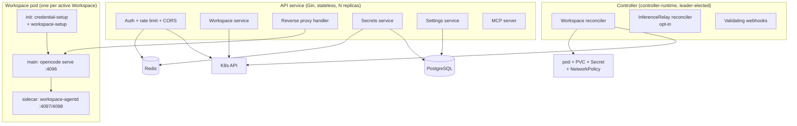
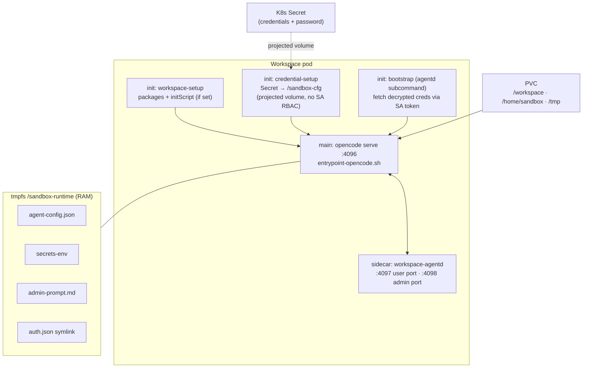

# Components in Depth

The platform is five cooperating processes. This page covers what each one **owns**, what it explicitly **does not own**, and the seams between them. For the request-level data flow, see the [architecture overview](index.md).



## API service

The public face. A Gin HTTP server (`api/`), stateless, horizontally scalable. Two replicas by default behind a load balancer; bump `api.replicaCount` to scale.

### What it owns

- **Authentication.** JWT (HMAC-SHA256) and `lsp_…` API keys. JWT revocation is dual-keyed (`token:<jti>` *and* `token:<hash>`) so revocation works regardless of which cache key a validator reads. Account lockout counters and the failed-auth timing-equalization live in Redis.
- **Ownership enforcement.** `WorkspaceAccessMiddleware` resolves the workspace, checks `WorkspaceOwner{UserID, OrgID}` against the caller's identity, and rejects with 403 on mismatch. This sits on the `idGroup` route group, which all proxy routes inherit — the G33 IDOR fix.
- **Workspace CRUD + lifecycle API.** Create/list/get/rename/delete, plus `suspend`/`activate`/`restart`. These mutate the CRD `spec` (the API is the sole writer of `spec.suspend`); the controller does the actual pod work.
- **Reverse proxy to pods.** Resolves pod IP from the cached CRD status, injects `Authorization: Basic <workspace-pw>`, and forwards. Strips client headers down to an explicit allowlist (`Content-Type`, `Accept`, `X-Request-ID`) and hop-by-hop headers in both directions — the G34 fix.
- **Encrypted secret store.** Encrypts user secrets with per-user DEKs (AES-256-GCM) before they ever touch PostgreSQL. The platform never stores or returns plaintext. See [secrets](secrets.md).
- **Provider credentials (admin + user) and auto-apply rules.** Admin credentials are encrypted under the master KEK; user credentials are encrypted with per-user DEKs.
- **Settings** (admin instance + user preferences) — declarative schema, stored in PostgreSQL.
- **Session management + SSE events + terminal proxy.** Session metadata is mirrored in PostgreSQL with backfill from the agent; the SSE stream is user-scoped.
- **Patch-part filtering.** Strips `type=="patch"` from message/history responses unless `?verbose=true`.

### What it does NOT own

- Pod or PVC lifecycle — that's the controller. The API only sets `spec.suspend` and lets the reconciler act.
- The `status.phase` field — the controller is the sole writer. The API's one status-ish write is `lastActivityAt`, and it goes to a **metadata annotation** (not `status`) precisely to avoid optimistic-concurrency conflicts.
- Credentials in plaintext — they live only in K8s Secrets and tmpfs. PostgreSQL stores ciphertext only.
- The agent loop — `opencode` owns sessions, tool execution, and conversation history internally.

### Initialization order

The API starts its dependencies in a fixed order with rollback on failure, and shuts them down in reverse:

```
Metrics → Database → Cache → Auth → Workspace → SessionIndex → Secrets → Settings → ProviderCredentials
```

`/livez` returns 200 if the process is responsive; `/readyz` pings Postgres and Redis and returns 503 if either is down.

## Controller

The Kubernetes operator (`controller/`), built on controller-runtime. Runs as a single leader-elected replica by default (`controller.leaderElection.enabled: true`).

### What it owns

- **Workspace reconciliation.** The state machine: `Pending → Creating → Active → Suspending → Suspended → Resuming → Active`, plus `Terminating`/`Terminated`/`Failed` branches. See [lifecycle](lifecycle.md). Each phase is a separate handler (`phase_pending.go`, `phase_creating.go`, `phase_active.go`, `phase_suspend.go`, `phase_terminating.go`).
- **Pod, PVC, Secret, and NetworkPolicy creation.** The reconciler builds the pod spec (init containers + main + agentd sidecar), creates the PVC owner-referenced to the Workspace, generates the workspace password Secret, and renders the per-workspace egress NetworkPolicy.
- **Health monitoring.** Polls `workspace-agentd`'s `/v1/healthz` + `/v1/statusz`; three consecutive failures kill the pod and the recovery policy decides whether to recreate it. Enriches CRD status with disk/memory/CPU/session metrics scraped from agentd.
- **Auto-suspend.** Watches `lastActivityAt`; if idle beyond `idleTimeoutSeconds` (default 86400s), transitions `Active → Suspending`. The final pre-suspend check reads the freshest activity to avoid racing an arriving request.
- **Org-level suspension (D20).** When `OrgStatusClient` is wired, polls the API every 30s; if the workspace's org is suspended, transitions to `Suspending` (pod killed, PVC retained).
- **Recovery.** Classifies failures (infrastructure / resource / process / configuration), applies exponential backoff, and enters "safe mode" after repeated same-class failures. See the recovery policy section in [lifecycle](lifecycle.md).
- **Validating webhooks.** `Workspace` and `RuntimeEnvironment` admission, plus the per-tenant `PodTenantQuotaValidator` (Epic 51). Enforces image-registry allowlists, storage caps, resource caps, and the gVisor opt-out admin gate.
- **InferenceRelay reconciliation (opt-in).** Provisions relay VMs via cloud-init, health-checks them, destroys + reprovisions on 429 storms. AWS + OCI drivers; GCP via the provider enum.

### What it does NOT own

- User-facing metadata — never touches PostgreSQL.
- The agent's internal state — sessions, context windows, tool calls are all opencode's.
- Authentication — that's the API.

### Sizing

The reconciler uses controller-runtime's informer cache — no direct K8s API calls for status lookups. Auto-suspend uses requeue-based timers (not polling), scaling with the number of workspaces. At 1,000+ workspaces consider sharding via leader election with namespace partitioning. Pod IP lookups always come from the cached CRD status, never direct pod lookups.

## Workspace pod

One pod per active `Workspace`. It is a three-container pod:



### Init containers

- **`workspace-setup`** (only when `spec.packages` or `spec.initScript` are set) — installs declared packages to `/workspace/packages` and runs the user's init script. Idempotent, so it's safe to rerun on every pod start (including resume).
- **`credential-setup`** — mounts the credentials Secret and password Secret via **projected volumes** (the kubelet mounts the data; the pod's SA has no Secret RBAC) and writes them to the shared `emptyDir` at `/sandbox-cfg`.
- **`bootstrap`** (agentd subcommand, Epic 35) — presents a projected SA token to the API's `/internal/v1/pod-bootstrap` and fetches decrypted credentials. Never blocks pod boot; degrades to empty on failure and the live `/v1/reload-secrets` push handles delivery.

### Main container

Runs `opencode serve --hostname 0.0.0.0 --port 4096` as a persistent HTTP server. The entrypoint sets `XDG_DATA_HOME=/workspace/.local` so session history persists to the PVC, and `OPENCODE_CONFIG=/sandbox-runtime/agent-config.json` so the relay-injected provider config always wins opencode's config merge (it's appended last).

Hardened security context on **all** containers: `readOnlyRootFilesystem: true`, `runAsNonRoot: true`, `allowPrivilegeEscalation: false`, `capabilities.drop: [ALL]`, `seccompProfile: RuntimeDefault`. `AutomountServiceAccountToken: false` — the pod's own SA token is never mounted. `EnableServiceLinks: false` — no namespace topology leaks via service env vars.

### agentd sidecar

`workspace-agentd` (`cmd/workspace-agentd`) supervises `opencode`:

- **Admin port `:4098`** — `/v1/healthz`, `/v1/statusz`, `/v1/readyz`, `/v1/metrics`. The controller polls these for health and metric enrichment; Prometheus scrapes `/metrics`. Token-gated.
- **User port `:4097`** — `/v1/reload-secrets` (live credential reload without pod restart). *Note: G40 is accepted — this port has no application-layer auth; the NetworkPolicy is the trust boundary (only API server pods can reach port 4097).*
- Owns the single `AgentConfigWriter` that builds `/sandbox-runtime/agent-config.json` atomically (temp-file + `os.Rename`), merging providers + model + relay sources. The one-shot relay injector runs ~T+7s after boot to discover free-tier models.
- Owns the reload-replay cache (`/sandbox-runtime/last-reload-secrets.json`) so user-DEK credentials survive a main-container restart (OOM, panic, kubelet restart) — without it, the boot-time `reset()` would wipe them.

## PostgreSQL

External; the chart does not bundle it (CloudNativePG, Bitnami postgresql, or raw manifests all work). The API connects via `pgx` with a connection pool (`postgresql.maxOpenConns: 25`).

### What it owns

- **Users** — accounts, password hashes (bcrypt cost 12), roles (first-user-becomes-admin via atomic SQL CTE).
- **API keys** — `lsp_…` keys, bcrypt-hashed, with `key_version` columns for KEK rotation.
- **Encrypted secrets** — the encrypted secret store. Each row is AES-256-GCM ciphertext under a per-user DEK; the DEK itself is wrapped by a KEK derived from the user's password. A DB compromise yields only useless ciphertext.
- **Wrapped DEKs** (`user_keys` table) — useless without the password (HKDF/Argon2id-derived KEK).
- **Org SSO configs** — client secrets encrypted under the master KEK.
- **Settings** — instance + user, declarative schema.
- **Usage events** — billing attribution.

### What it does NOT own

- Credentials in plaintext — never.
- Workspace phase / pod IP / PVC name — that's the CRD.
- Anything the controller reconciles.

## Redis / Valkey

External; the chart does not bundle it. Auto-generated 32-char password on first install (the G26 fix — no default passwords).

### What it owns

- **Rate limiting** counters (global + per-endpoint).
- **Model cache** (5s TTL) — the per-replica catalog cache; `SetModel` evicts on the handling replica only, so other replicas serve stale for up to 5s.
- **DEK cache** — per-user data encryption keys, decrypted and held in memory for the session TTL so the API doesn't re-run Argon2id on every request. Protected by Redis auth + the datastore NetworkPolicy.
- **Account lockout** counters (keyed on email + client IP — G13 fixed: an attacker from a different IP cannot trigger the victim's lockout).
- **SSE connection tracking** (G42 is open — the `sseConnCounts` map is never pruned).
- **JWT revocation** set — `token:<hash>` and `token:<jti>` for dual-key revocation.

!!! warning "Production requirement (H3)"
    The API caches per-workspace `opencode` passwords in Redis in **plaintext** (`wsstate.SetCachedPassword`) because the proxy needs the plaintext for Basic-Auth on every forwarded request. Production Redis deployments **must** provide TLS in-transit, at-rest encryption, and a NetworkPolicy restricting ingress to API pods. Without these, workspace passwords are exposed in RDB/AOF dumps, memory, and backups.

## Seams and contracts

The components communicate through a small number of explicit contracts:

| Seam | Contract |
|---|---|
| API ↔ Controller | The `Workspace` CRD. API writes `spec` (esp. `spec.suspend`); controller writes `status`. The `lastActivityAt` annotation is the API's one cross-cutting write, deliberately in `metadata` to avoid status-write conflicts. |
| API ↔ Pod | Reverse-proxy HTTP to `:4096`, authenticated with HTTP Basic Auth using the controller-generated workspace password (read once from the Secret, cached, invalidated on phase change to `Suspending`/`Suspended`/`Terminated`). |
| Controller ↔ Pod | `agentd` admin port `:4098` for health/status/metrics. Three-strike failure → pod kill. |
| API ↔ PostgreSQL | `pgx` parameterized queries (SQL injection mitigated). |
| API ↔ Redis | `go-redis` with auth. |

The contracts are intentionally narrow. The platform's value is the orchestration, isolation, and multi-tenant control layer — *not* the agent loop. Per the codebase's containment-before-abstraction rule, knowledge of `opencode`'s internals is kept behind a single seam; platform code talks to that seam, it does not know what is behind it. (See README-LLM.md Rule 12 for the full rationale.)
