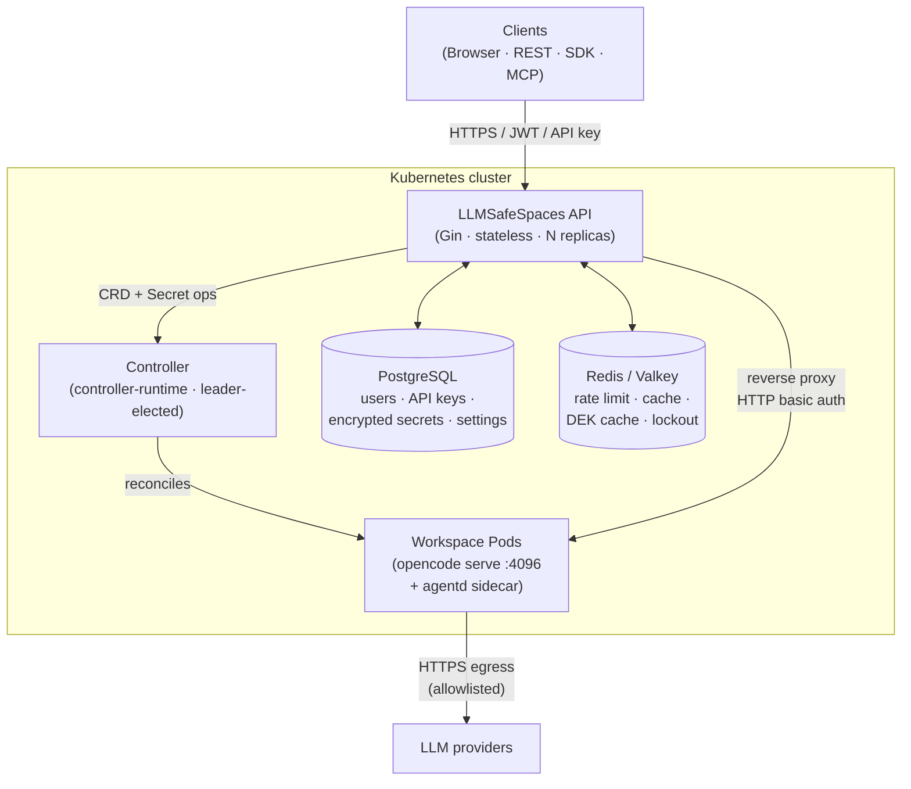
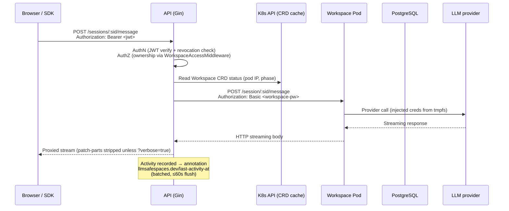
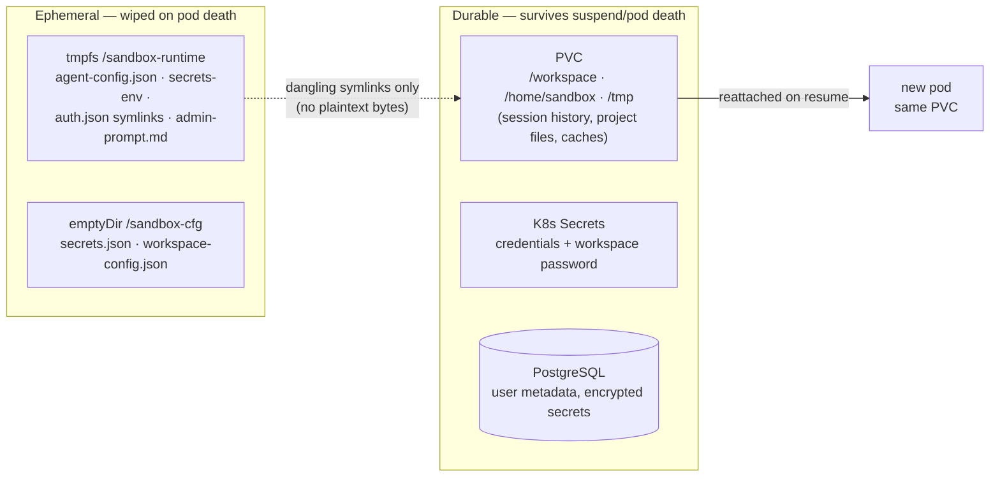

# Architecture Overview

LLMSafeSpaces is a Kubernetes-first platform that runs AI agents in isolated, persistent workspaces. This page covers the big picture: what talks to what, why the system is shaped the way it is, and how a single request flows end to end.

If you only read one page, read this one. For depth, follow the links into [components](components.md), [lifecycle](lifecycle.md), [secrets](secrets.md), and the [threat model](threat-model.md).

## System at a glance

Five processes do all the work:

| Process | Role | Stateless? |
|---|---|---|
| **API** (Gin) | Auth, ownership checks, reverse proxy to pods, secrets/settings/credentials, session tracking, SSE events | Yes |
| **Controller** (controller-runtime) | Reconciles `Workspace` / `RuntimeEnvironment` / `InferenceRelay` CRDs into pods, PVCs, Secrets, NetworkPolicies; health monitoring | Leader-elected |
| **Workspace pod** | `opencode serve` HTTP server on `:4096` + `workspace-agentd` sidecar; PVC at `/workspace` | One per active workspace |
| **PostgreSQL** | User metadata, API keys, **encrypted** secrets, instance/user settings | External |
| **Redis / Valkey** | Rate limiting, model cache, DEK cache, account lockout counters, SSE tracking | External |

The [components](components.md) page covers what each one owns in detail.

## The three CRDs

Everything long-lived is a Kubernetes custom resource in the `llmsafespaces.dev/v1` group:

| Kind | Scope | Short | Purpose |
|---|---|---|---|
| `Workspace` | Namespaced | `ws` | PVC-backed persistent environment + pod running `opencode serve`. The unit of suspend/resume. |
| `RuntimeEnvironment` | Cluster | `rte` | Mapping from a runtime name (e.g. `python:3.11`) to a container image. |
| `InferenceRelay` | Cluster | `irelay` | Opt-in fleet of relay VMs (AWS/OCI/GCP) proxying free-tier inference. Requires `rbac.scope=cluster`. |

Legacy CRDs (`Sandbox`, `SandboxProfile`, `WarmPool`, `WarmPod`) have been removed — `Workspace` absorbs all sandbox and profile functionality, and warm pools were dropped entirely (the PVC *is* the warm state). See the [CRD reference](../reference/crds.md) for the authoritative schema.

## How a request flows

A typical interactive chat message touches every component. Here is the exact path for `POST /api/v1/workspaces/:id/sessions/:sid/message`:

Key details the diagram hides:

1. **The API never touches the LLM provider.** Credentials live in a tmpfs inside the pod (`/sandbox-runtime`); the pod's `opencode` process calls the provider directly. The API only reverse-proxies the pod's own HTTP API.
2. **Pod IP comes from the CRD status cache**, not a direct pod lookup. If the IP is stale (pod restarted), the proxy refreshes from the cache and retries once.
3. **The proxy strips client headers.** Only `Content-Type`, `Accept`, `X-Request-ID` are forwarded to the pod — `Cookie`, `Origin`, `Referer`, `X-Forwarded-*` and custom headers are dropped, and hop-by-hop headers (RFC 7230 §6.1) are stripped in both directions. This was the G34 fix.
4. **`?verbose=true`** keeps the `type=="patch"` parts opencode emits on every assistant turn (~2 KB of internal snapshot paths the UI doesn't render).

## Design principles

### Why a stateless API?

The API holds **no session state**. All conversation history, context windows, and in-flight tool calls live inside the pod's `opencode` process. This means:

- Any API replica can proxy any workspace — **no sticky sessions**.
- An API restart drops only in-flight HTTP connections; clients reconnect with backoff and lose nothing (opencode keeps its state on the PVC).
- Horizontal scaling is a `replicaCount:` bump — `N` pods behind a load balancer.

The only in-memory state the API keeps is per-replica caches (password cache keyed by workspace ID, model cache with a 5s TTL, active-session tracking for the per-workspace limit) and the activity-tracker timestamp. None of it is authoritative.

### Why CRD-backed state?

Kubernetes is the source of truth for **infrastructure** state; PostgreSQL is the source of truth for **user-facing metadata**. The split is strict and never overlaps:

| Data | Source of truth | Why |
|---|---|---|
| Workspace phase, PVC name, pod IP, conditions | `Workspace` CRD `status` | The controller reconciles this; the API reads it. |
| `lastActivityAt` | `Workspace` CRD **annotation** (not status) | The API is the sole writer; the annotation lane avoids optimistic-concurrency conflicts with the controller's `Status().Update`. |
| Workspace display name, user ID mirror, timestamps | PostgreSQL | Query performance for list/get. The CRD `spec.owner` is authoritative for ownership. |
| Credentials | Kubernetes Secrets | **Never** PostgreSQL, Redis, or logs. |
| User auth (passwords, API keys, DEKs), encrypted secrets, settings | PostgreSQL | The API's domain. |

The single-writer-per-field rule (US-23.3) is what makes this safe. Each `status` field has exactly one owner; cross-writer optimistic-concurrency races were the root cause of multiple historical incidents.

### Why a shared namespace for multi-tenant?

LLMSafeSpaces does **not** create a namespace per tenant. All workspaces in one deployment run in one namespace (configurable via `controller.watchNamespaces`). This is a deliberate choice:

- **Namespaces don't stop container escape.** A tenant who breaks out of a pod reaches the node, not just their namespace. Namespace isolation is a false sense of security for kernel-level threats.
- **Namespaces don't scale to 1,000+ tenants.** Per-namespace RBAC, NetworkPolicy, and quota objects multiply linearly; controller caches and kube-apiserver load suffer.

Instead, tenant isolation is layered controls in the shared namespace:

| Control | Status | Mechanism |
|---|---|---|
| Network isolation | Shipped | Chart-level default-deny ingress + RFC1918/CGNAT/cloud-metadata-filtered egress NetworkPolicies |
| Secret scoping | Shipped | `rbac.scope=namespace` default; namespace-scoped Secrets Role |
| Tenant identity | Shipped | `WorkspaceOwner{UserID, OrgID}` on the CRD; `llmsafespaces.dev/tenant` pod label |
| Container-runtime isolation | Opt-in (Epic 51) | gVisor (`runsc`) RuntimeClass — the primary defense against kernel-exploitation container escape |
| Per-tenant resource quotas | Opt-in (Epic 51) | `PodTenantQuotaValidator` admission webhook keyed on the tenant label |

See the [threat model](threat-model.md) and [components](components.md) for the full picture, and the operator guide on multi-tenant isolation for configuration.

## What's warm, what's cold

The platform distinguishes durable state (survives pod deletion) from ephemeral state (wiped on pod death):

This is why **suspend/resume is cheap**: the PVC is already bound, so resuming is just "create a new pod mounting the existing PVC" (~22s measured; the PVC reattach + opencode boot dominate). The PVC *is* the warm state — there are no warm pools.

The credential story is the subtle part: credentials live in tmpfs (RAM-backed), so when a pod dies the PVC retains only **dangling symlinks** with no plaintext bytes. The next pod's init container re-materializes everything from the K8s Secret + the reload-replay cache. The [secrets](secrets.md) page covers this in depth.

## What the platform is — and isn't

**It is:** an orchestration, isolation, and multi-tenant control layer around an AI agent. Every workspace runs `opencode serve` as a persistent HTTP server; the platform handles lifecycle, credentials, access control, and proxies your requests to it.

**It isn't:**

- A general container platform (use Kubernetes directly).
- A CI/CD runner (use GitHub Actions, Jenkins).
- A bare code-execution service (every workspace has an agent; there is no "just run this command" mode).
- A real-time multiplayer collaboration tool (one user per workspace; RWO PVC enforces one pod at a time).
- A sub-second cold-start service (3-5s pod creation is fine; long-lived agents absorb the cost).

The authoritative design document is [`design/0021_2026-05-21_evolution-v2.md`](https://github.com/lenaxia/LLMSafeSpaces/blob/main/design/0021_2026-05-21_evolution-v2.md). Historical design docs are archived under `design/archive/v1/`.
