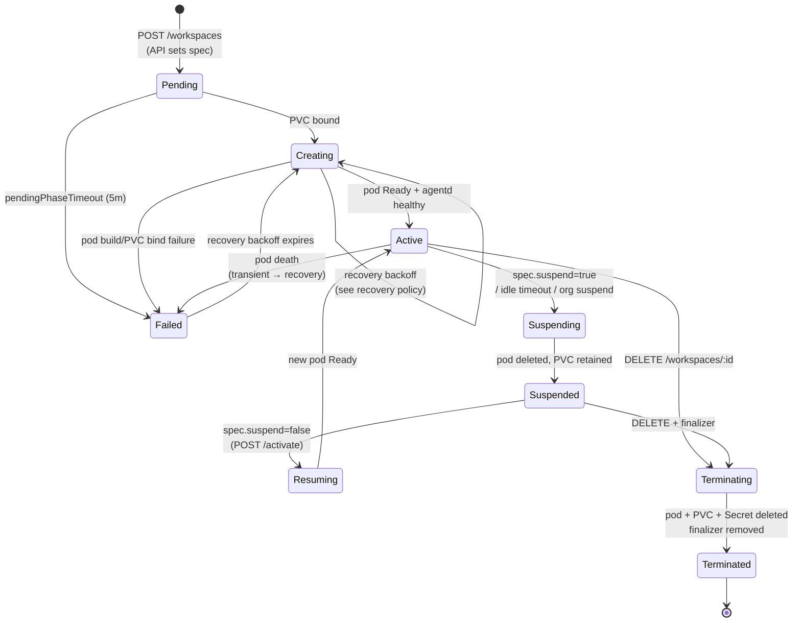
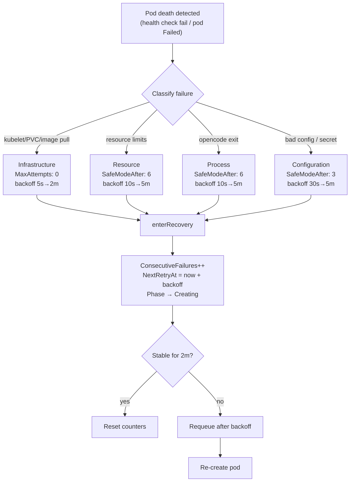

# Workspace Lifecycle

A `Workspace` moves through a state machine driven by the controller. This page covers every phase, what each transition does, how PVC state is preserved across suspend/resume, what happens when a pod dies, and the recovery policy that decides whether to recreate a failed pod.

## The state machine

Nine phases total, dispatched in `reconciler.go` by `switch workspace.Status.Phase`:

| Phase | Handler | Meaning |
|---|---|---|
| `Pending` | `handlePending` | CRD created; PVC provisioning in progress |
| `Creating` | `handleCreating` | PVC bound; pod being built/scheduled |
| `Active` | `handleActive` | Pod Ready, agentd healthy; serving requests |
| `Suspending` | `handleSuspending` | Deleting the pod (transient) |
| `Suspended` | `handleSuspended` | Pod deleted; PVC retained |
| `Resuming` | `handleResuming` | Recreating the pod on the existing PVC |
| `Terminating` | `handleTerminating` | Finalizer cleaning up pod + PVC + Secret |
| `Terminated` | `handleTerminating` | All resources gone; finalizer removed |
| `Failed` | `handleFailed` | Recovery exhausted or unrecoverable |

## Phase-by-phase

### Pending → Creating

A `POST /api/v1/workspaces` creates the CRD with an empty `status.phase`. The controller's `handlePending`:

1. Adds the `workspace.llmsafespaces.dev/finalizer` finalizer (so deletion can clean up).
2. Records the `pendingAt` startup-latency anchor (prefers the `llmsafespaces.dev/requested-at` annotation the API writes at POST time, so the measurement covers full user-perceived latency).
3. Creates the PVC, owner-referenced to the Workspace, labeled `app=llmsafespaces`, `component=workspace`, `llmsafespaces.dev/workspace=<name>`.
4. Transitions to `Creating` once the PVC is `Bound` (or `WaitForFirstConsumer` binding mode is in play and the pod is scheduling).

If the workspace stays Pending beyond `pendingPhaseTimeout` (5 minutes), it enters recovery → `Failed` with `FailureReason: PendingTimeout`.

### Creating → Active

`handleCreating` builds the pod (init containers + main + agentd sidecar), creates the password Secret, and waits. Pod state changes arrive via the `Owns(Pod)` watch; PVC Bound transitions via `Owns(PersistentVolumeClaim)`. A 2s safety-net poll (`requeueCreating`) catches anything the watches miss.

Transition to `Active` requires:

- The pod is `Ready`.
- The agentd sidecar reports healthy (`/v1/healthz`).
- Credentials are resolved (the `CredentialsAvailable` condition).

At this point the controller records `WorkspaceCreateDurationSeconds`, the API proxy can reach the pod, and the active-session limit starts enforcing.

### Active

`handleActive` runs every 15s (`requeueActive`) plus on every watch event. Each reconcile:

- Refreshes the egress NetworkPolicy (FQDN → IP resolution, 5-min refresh).
- Runs health checks against agentd (3-strike threshold).
- Enriches status with disk/memory/CPU/session metrics scraped from agentd's `/v1/statusz`.
- Checks idle auto-suspend.
- Checks org-level suspension (if `OrgStatusClient` is wired).

### Active → Suspending → Suspended

A suspend is triggered by `POST /api/v1/workspaces/:id/suspend` (which sets `spec.suspend: true`), idle timeout, org-level suspension, or a TTL. `handleSuspending`:

1. Deletes the pod (graceful SIGTERM, 30s for in-flight LLM calls, then SIGKILL).
2. **Retains the PVC.** This is the whole point of suspend.
3. Clears `spec.suspend` to `nil` (so a stale value doesn't cause an immediate re-trigger).
4. Transitions to `Suspended`.

### Suspended → Resuming → Active

A resume is `POST /api/v1/workspaces/:id/activate` (sets `spec.suspend: false`). `handleResuming`:

1. Creates a new pod with the same spec, mounting the **existing** PVC.
2. The init containers re-run: `credential-setup` re-materializes credentials from the K8s Secret, `workspace-setup` re-installs declared packages (idempotent).
3. Transitions to `Active` when the pod is Ready.

This is the "warm" path: the PVC is already bound, so resume is just "create a new pod mounting an existing PVC" — measured at ~22s post-optimization (PVC reattach + opencode boot dominate; the original ~3s was an unvalidated design target).

### Terminating → Terminated

`DELETE /api/v1/workspaces/:id` (or `ttlSecondsAfterSuspended` expiring) sets a deletion timestamp. `handleTerminating`:

1. Deletes the pod by name.
2. **Deletes the PVC** (this is what distinguishes delete from suspend).
3. Deletes the password Secret (`workspace-pw-<name>`).
4. Records the `WorkspacesDeleted` metric.
5. Clears pod-related status fields.
6. Removes the finalizer → Kubernetes GC reaps the object.

!!! warning "G36 is open"
    The termination path currently only deletes `workspace-pw-*`. `workspace-secrets-*` and `workspace-creds-*` persist indefinitely — `deleteEphemeralSecretsSecret` exists but is not called from `handleTerminating`. Credentials bound via the zero-knowledge secret store are owner-referenced to the Workspace CRD and GC'd correctly; the gap is specifically the controller-generated credential Secrets.

## PVC retention semantics

The PVC is the durable state. Its lifecycle is intentionally simple:

| Operation | Pod | PVC | Credentials (Secret) |
|---|---|---|---|
| Suspend | Deleted | **Retained** | Retained |
| Activate/Resume | Recreated | Reattached | Re-read by init container |
| Restart | Deleted + recreated | Retained (same pod) | Reloaded |
| Delete (Terminating) | Deleted | **Deleted** | Deleted (password); see G36 caveat |

The PVC is `ReadWriteOnce` by default — one pod at a time. `ReadWriteMany` is supported for storage classes that allow it (NFS, CephFS), but the user is responsible for coordination. There is no `maxSessions` field; the reconciler enforces the constraint via the access mode.

### What survives on the PVC

`/workspace`, `/home/sandbox`, and `/tmp` are all PVC subPaths. This means:

- **Agent session history** at `/workspace/.local/opencode/` survives suspend/resume.
- **Project files** survive.
- **Package caches** survive (so `pip install --target /workspace/packages` is fast on resume).
- **SSH keys / git credentials** as symlinks — the symlink target lives in tmpfs and is wiped on pod death, so the PVC retains only a dangling symlink with **no plaintext bytes**.

### What does NOT survive (tmpfs)

`/sandbox-runtime` (the agent's live config: `agent-config.json`, `secrets-env`, `admin-prompt.md`, the `auth.json` symlink target, the reload-replay cache) is a `tmpfs` (RAM-backed emptyDir). On pod death it's wiped. The next pod's init containers re-materialize everything from the K8s Secret and, for user-DEK credentials, the reload-replay cache (`/sandbox-runtime/last-reload-secrets.json`) — which itself is tmpfs, so a *hard* pod death loses user-DEK credentials until the next `/v1/reload-secrets` push.

This is deliberate: it keeps plaintext credentials off the PVC at rest. See [secrets](secrets.md).

## Pod death and recovery

When a pod dies (crash, OOM, node loss), the controller doesn't just blindly recreate it. It classifies the failure and applies a recovery policy.

### Failure classification

The four failure classes and their policies:

| Class | Examples | Backoff base / max / factor | Safe mode after |
|---|---|---|---|
| `Infrastructure` | kubelet unreachable, PVC bind, image pull | 5s / 2m / 2x | 0 (never safe-modes) |
| `Resource` | OOM, CPU exhaustion | 10s / 5m / 2x | 6 failures |
| `Process` | opencode panic, exit non-zero | 10s / 5m / 2x | 6 failures |
| `Configuration` | bad secret, invalid config | 30s / 5m / 2x | 3 failures |

`MaxAttempts: 0` means no hard cap on retries — the controller backs off exponentially and will keep trying, but safe mode kicks in for repeated same-class failures.

### Safe mode

When `ConsecutiveFailures` hits the class threshold, the workspace enters **safe mode** (`status.safeMode: true`, `SafeMode` condition). Safe mode is a signal to operators and the frontend that something is wrong; it doesn't change reconciliation behavior directly. Safe mode exits when:

- The workspace stabilizes (2 minutes of health → counters reset), or
- The workspace is terminated (`SafeModeExitsTotal{reason="termination"}`).

### Counter reset

After 2 minutes of stability (`maybeResetConsecutiveFailures`), the controller clears `ConsecutiveFailures`, `LastFailureClass`, `LastFailureAt`, `NextRetryAt`, `LastStableAt`, and `ControllerRestartCount`. This prevents a workspace that had one bad day from carrying recovery baggage forever. The guard checks **both** `ConsecutiveFailures` and `ControllerRestartCount` because a health-check restart bumps the latter without touching the former (worklog 0372 C1).

### Transient pod loss

A specific, recoverable case: the pod disappeared but the PVC and configuration are intact (node drain, spot interruption, kubelet restart). `FailureReason: TransientPodLoss` skips the heavy recovery machinery and just recreates the pod — the PVC reattaches, init containers re-run, and the workspace comes back. This is the common case in production.

## Auto-suspend

When `autoSuspend.enabled: true` (default), the controller watches for idle periods:

1. On each `Active` reconcile, compute remaining idle time.
2. Requeue at `idleTimeoutSeconds * 0.8` from last activity (scales with the timeout, not a fixed poll).
3. If `time.Since(lastActivityAt) > idleTimeoutSeconds`, transition to `Suspending`.
4. **Race guard:** immediately before deleting the pod, re-read the freshest activity. If activity arrived after the requeue trigger, cancel the suspend.

Activity is recorded by the proxy handler on each proxied request and flushed to the `llmsafespaces.dev/last-activity-at` annotation at most once per 60s (batched, `RetryOnConflict` with 3-attempt backoff, strategic merge patch on only the annotation to minimize conflict surface).

If `ttlSecondsAfterSuspended > 0`, the reconciler also requeues for suspended workspaces and transitions to `Terminating` when the TTL expires — automatic garbage collection of stale workspaces.

## Org-level suspension (D20)

When the controller's `OrgStatusClient` is wired (`--api-service-url` + `internalToken`), every `Active` reconcile of an org-owned workspace (`spec.owner.orgID != ""`) consults the API (30s cached lookup). If the org is suspended, the workspace transitions `Active → Suspending` — pod killed, PVC retained, identical to a user-initiated suspend. Lookups fail open (workspace keeps running) to avoid a controller-API outage suspending everything.

## Measuring startup and resume latency

The controller records two histograms for observability:

- `WorkspaceCreateDurationSeconds` — from `pendingAt` (preferring the `requested-at` annotation) to `Active`.
- `WorkspaceResumeDurationSeconds` — from `resumedAt` to `Active`.

Both have stale-anchor protection: if more than `maxStartupAnchorAge` elapses between anchor and transition (e.g. after a controller restart), the observation is dropped and the anchor cleared to avoid inflating the histogram with multi-hour values.
