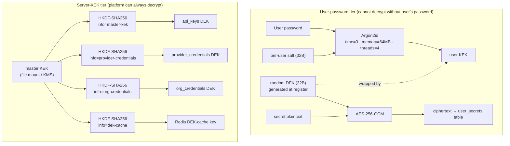
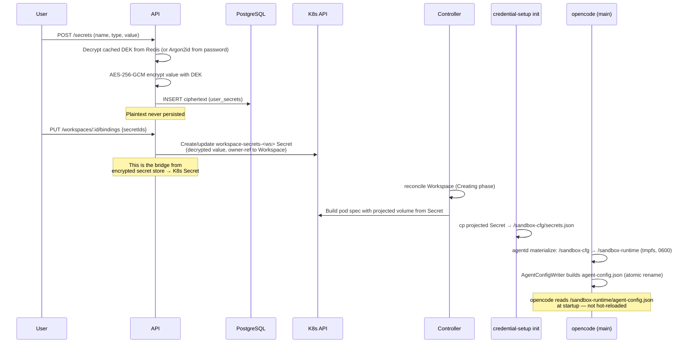

# Secret Management

This is the deep dive on how LLMSafeSpaces stores, derives, delivers, and rotates secrets. There are two distinct encryption tiers — read this page with that distinction in mind:

1. **User-password tier** — user-supplied secrets (LLM keys, SSH keys, env vars) encrypted with per-user DEKs the platform cannot derive without the user's password. Lives in PostgreSQL as ciphertext.
2. **Server-KEK tier (master KEK)** — the server-side key that wraps platform-owned secrets (admin/org LLM API keys, org SSO client secrets, API-key DEKs, the Redis DEK cache). The platform needs to read these to function, so they are always decryptable by the platform. Delivered to the API pod via a file mount; optionally backed by cloud KMS.

Workspace runtime credentials (the things `opencode` actually reads at runtime) are a third path: they live in K8s Secrets and are materialized into tmpfs — never in PostgreSQL, Redis, or logs.

## The two-tier model



The two tiers never share key material. A compromise of the user-password tier (e.g. a stolen password) cannot decrypt server-tier rows, and vice versa. See [Two encryption tiers](../operator/security.md#two-encryption-tiers-read-this-if-you-operate-multi-tenant) in the operator guide for the tradeoff discussion.

## User-password tier (the encrypted secret store)

The platform never stores user-secret plaintext. Not in PostgreSQL, not in Redis, not in logs, not in API responses (`POST /secrets/:id/reveal` decrypts on demand; `GET /secrets` returns metadata only).

### Registration → DEK generation

When a user registers:

1. A random 32-byte **DEK** is generated (`crypto/rand`).
2. A random 32-byte **salt** is generated.
3. The user's password is run through **Argon2id** (`time=3`, `memory=64MB`, `threads=4`, `keyLen=32`) with the salt to produce the **user KEK**.
4. The DEK is wrapped (AES-256-GCM) by the KEK.
5. PostgreSQL stores: the wrapped DEK (`user_keys.wrapped_dek`), the salt, and the KDF version. **Never** the password, never the unwrapped DEK.

### Decryption at request time

To decrypt a user secret, the API needs the unwrapped DEK. The flow:

1. User authenticates (password verified against bcrypt hash).
2. The password is run through Argon2id with the stored salt → KEK.
3. The KEK unwraps the DEK.
4. The DEK decrypts the requested secret.
5. The unwrapped DEK is cached in **Redis** (session-scoped, with a TTL) so step 2-3 don't repeat on every request. Argon2id is deliberately expensive.

The cached DEK is what makes a Redis compromise dangerous (asset G2.2 in the threat model). Redis auth + the datastore NetworkPolicy + at-rest encryption are mandatory in production.

!!! note "KDF versions"
    Two KDF versions exist for backward compatibility:
    
    - **V0 (HKDF):** `KEK = HKDF-SHA256(password, salt, info="llmsafespaces-kek")`. The original.
    - **V1 (Argon2id, current):** `KEK = Argon2id(password, salt)`. Memory-hard; the default for all new users (`KDFCurrentVersion = KDFVersionArgon2id`).
    
    The KDF version is stored per-user so old rows keep decrypting.

### Encryption (AES-256-GCM)

Every secret value is encrypted with AES-256-GCM using the DEK. GCM provides authenticated encryption — tampering with the ciphertext or nonce causes decryption to fail with `ErrDecryptionFailed`. A fresh random nonce is generated per encryption.

## The master KEK — root of trust

The master KEK is the platform's root key. It wraps platform-owned secrets that the server itself must be able to decrypt (unlike user secrets, which need the user's password):

- **Admin/org LLM API keys** (`provider_credentials` table)
- **Org SSO client secrets** (`org_sso_configs` table)
- **API-key DEKs** (`api_keys` table) — API keys are bcrypt-hashed for lookup, but the wrapped DEK lets the server rotate them
- **The Redis DEK cache key** — protects cached user DEKs at rest in Redis

### Domain separation (HKDF)

The master KEK is never used directly. Each consumer derives an independent sub-key via **HKDF-SHA256** with a distinct `info` string:

| Purpose string | Protects |
|---|---|
| `master-kek` | `api_keys` (new rows, US-50.7) |
| `dek-cache` | Redis DEK cache (legacy `api_keys` + `org_sso_configs` rows pre-US-50.7) |
| `provider-credentials` | Admin/org LLM API keys |
| `org-credentials` | Org-level credentials |

This is the US-50.7 domain separation: previously `api_keys` reused the Redis DEK-cache purpose, so a Redis compromise could help unwrap Postgres rows. Now they're cryptographically independent — compromising one purpose's derived key does not help with another.

### Delivery: file mount (US-50.1, default)

The master KEK is delivered to the API pod as a **read-only file mount** at `/var/run/secrets/llmsafespaces/master-secret` (mode 0440, subPath). This is the G48 fix.

```yaml
# api-deployment.yaml (simplified)
volumes:
  - name: master-secret
    secret:
      secretName: llmsafespaces-master-secret
      items:
        - key: master-secret
          path: master-secret
          mode: 0440
containers:
  - name: api
    volumeMounts:
      - name: master-secret
        mountPath: /var/run/secrets/llmsafespaces/master-secret
        subPath: master-secret
        readOnly: true
```

The API reads it via `LLMSAFESPACES_MASTER_SECRET_FILE`. **Why a file mount instead of an env var?** An env var (`LLMSAFESPACES_MASTER_SECRET`) is readable via `/proc/1/environ` by any same-UID process; a file mount is not. The file loader fails closed on a mis-mounted or short active file.

The legacy env-var delivery remains as a deprecated opt-in (`masterSecret.deliveryMethod: "env"`) for non-Helm deployments (bare `kubectl apply`, docker-compose). The API logs a deprecation warning when this path is used. Multi-file colon-separated paths support the future rotation window (active = last ≥32-byte file).

### Delivery: sealed key (production self-hosted)

For production self-hosted deployments that cannot rely on a kubelet Secret alone, the **sealed-key provider** wraps the root key under an Argon2id KEK derived from an operator passphrase. The sealed file on disk is useless without the passphrase. Generate it with:

```bash
# Generate a sealed key (root key never printed unless -print-key)
seal-key -out master.sealed -passphrase-file passphrase.txt
```

The sealed file format:

- **V1 (current, US-50.11):** `magic "LSKP-S"` ‖ `salt(32)` ‖ `nonce(12)` ‖ `ciphertext`. KEK = `Argon2id(passphrase, HKDF(salt, info="llmsafespaces-sealed-root"))` — the HKDF mixes the info into the salt for domain separation.
- **V0 (legacy):** `salt(32)` ‖ `nonce(12)` ‖ `ciphertext`, plain Argon2id with no info. Still readable for in-place upgrades.

The magic prefix is the one place a ciphertext-format version is justified: sealed-key files are standalone artifacts detached from any DB row's `key_version` column.

### Delivery: cloud KMS (Epic 57, US-57.1) — opt-in

The newest option. The master KEK is backed by **AWS KMS** (GCP KMS planned). The key material **never leaves AWS** — every Encrypt/Decrypt is a network round-trip to the KMS API.

This converts an API-pod RCE from "permanent KEK exfiltration for offline DB decrypt" to "ephemeral compromise bounded by the RCE window" — *exfiltration limitation + audit, not prevention*. An attacker running code in the pod can still call `Decrypt` exactly as the application does while the RCE persists.

Three KMS keys are required (D4: per-purpose domain separation):

| Helm `kms.aws.keyArns.*` | Protects |
|---|---|
| `providerCredentials` | Admin/org LLM API keys |
| `orgCredentials` | Org-level credentials |
| `masterKek` | API keys + org SSO client secrets (shared provider) |

```yaml
kms:
  aws:
    enabled: true
    region: us-east-1
    credentialsSecret: "aws-kms-creds"
    keyArns:
      providerCredentials: "arn:aws:kms:us-east-1:123:key/provider-creds"
      orgCredentials: "arn:aws:kms:us-east-1:123:key/org-creds"
      masterKek: "arn:aws:kms:us-east-1:123:key/master-kek"
```

!!! warning "D9: KMS availability"
    Sustained KMS unavailability (regional outage, network partition) causes **all** KEK-dependent decrypts to fail simultaneously. Multi-region KMS key replicas are recommended for HA. The `CompositeProvider`'s static fallback only decrypts legacy un-prefixed rows; it does not mitigate KMS-primary unavailability.

The master-secret file mount is **retained under KMS** — it protects the Redis DEK cache (volatile, regenerable). KMS protects only the durable KEK-protected Postgres tables.

The `CompositeProvider` (PR #510/#511) dispatches Decrypt by ciphertext prefix (`lkms:v1:`, `aws-kms:v1:`) and is primary for Encrypt, with prefix-aware local providers falling back for legacy un-prefixed blobs — enabling zero-downtime migration.

### `key_version` columns and rotation

Postgres tables that hold KEK-protected ciphertext carry a `key_version` column (migrations 42/43, US-50.3). The rotation-aware write path populates the active version on every encrypt (US-50.6); the multi-key `StaticKeyProvider` (US-50.4) decrypts with whichever version the row records. This is the foundation for zero-downtime KEK rotation.

## The `rotate-kek` CLI

The operational rotation tool (`cmd/rotate-kek`, US-50.5) re-wraps every KEK-protected row under a new master key:

```bash
rotate-kek \
  -old-master-file /etc/llmsafespaces/old-master \
  -new-master-file /etc/llmsafespaces/new-master \
  -database-url "postgres://..." \
  -redis-url "redis://..." \
  -table all \
  -target-version 2
```

What it does:

1. Loads old + new master keys, derives old + new providers for every purpose string (`provider-credentials`, `org-credentials`, `master-kek`, `dek-cache`).
2. Connects to Postgres + Redis.
3. For each row in the target table(s): decrypt with the old provider for that row's purpose, re-encrypt with the new provider, bump `key_version`.
4. Flushes the Redis DEK cache (so stale entries don't survive rotation).

Flags:

| Flag | Purpose |
|---|---|
| `-old-master-file` / `-new-master-file` | Paths to the old/new master key files (required) |
| `-database-url` | Postgres connection string (required) |
| `-redis-url` | Redis connection string (required for DEK cache flush) |
| `-table` | `all`, `provider_credentials`, `api_keys`, or `org_sso_configs` |
| `-resume-from` | Resume from this row ID after an interrupted run |
| `-target-version` | Target key version (default 2) |
| `-dry-run` | Report counts without writing |

The CLI handles all four purposes and supports resuming an interrupted run. The operational runbook is the remaining piece (tracked as a doc task, not a security gap).

## The credential injection path

This is how a secret gets from "user typed it into the API" to "opencode reads it inside the pod." The path has several stages, each with a distinct storage location:



### What lives where

| Location | What | Persists across pod death? | Encrypted at rest? |
|---|---|---|---|
| **PostgreSQL** (`user_secrets`) | Encrypted ciphertext (user secrets) | Yes (it's the DB) | Yes (AES-256-GCM under per-user DEK) |
| **PostgreSQL** (`provider_credentials`, `api_keys`, `org_sso_configs`) | KEK-protected ciphertext (platform secrets) | Yes | Yes (under master KEK via HKDF purposes) |
| **K8s Secret** (`workspace-secrets-<ws>`, `workspace-pw-<ws>`) | Decrypted workspace runtime credentials + workspace password | Yes (until workspace deleted) | Only if etcd encryption at rest is configured (A1) |
| **tmpfs** `/sandbox-runtime` | Live agent config, secrets-env, auth.json symlink, admin-prompt.md, reload-replay cache | **No** — wiped on pod death | N/A (RAM) |
| **emptyDir** `/sandbox-cfg` | secrets.json, workspace-config.json, password (from init) | No (ephemeral per pod) | N/A |
| **PVC** `/workspace`, `/home/sandbox`, `/tmp` | Session history, project files, package caches, **dangling symlinks** for credential paths | Yes | N/A (operator responsibility — A1) |

The critical property: **plaintext credentials never touch the PVC.** The `$HOME`-relative credential paths (`.ssh`, `.secrets`, `.git-credentials`, `auth.json`) are symlinks created by the init container pointing into `/sandbox-runtime/rt/*` (tmpfs). On pod death, tmpfs is wiped and the PVC retains only dangling symlinks — no plaintext bytes.

### The reload-replay cache (worklog #443)

User-DEK credentials (env-secrets like `GH_TOKEN`, SSH keys, user LLM providers) are delivered via the live `/v1/reload-secrets` push, not the bootstrap init container (which only carries server-KEK creds). Without a cache, a main-container restart (OOM, panic, kubelet restart) would wipe them — the boot-time `reset()` clears tmpfs, and the base `secrets.json` never contained them.

The fix: after every successful reload, agentd writes the batch to `/sandbox-runtime/last-reload-secrets.json` (tmpfs). On the next boot, the materialize subcommand:

1. Loads base `/sandbox-cfg/secrets.json` (server-KEK creds from bootstrap).
2. Loads `/sandbox-runtime/last-reload-secrets.json` (cached user-DEK creds), merged on top — cache wins on duplicate `Type+Name`.
3. `reset()` wipes tmpfs credential files.
4. `Materialize(merged)` re-applies both base + cached user-DEK creds.

Absent cache = first boot (base only). Corrupt cache = warn + base only. The cache is written after `Materialize` succeeds, never on a hard failure (500), and degrades to base-only on a corrupt read.

### Live reload without pod restart

`POST /api/v1/workspaces/:id/reload-secrets` (proxied to agentd's `/v1/reload-secrets` on `:4097`) hot-reloads credentials into a running pod:

1. `reloadMu.Lock()` → `Materializer.reset()` → `Materialize(batch)` → `FormatProviders()`.
2. `writer.SetProviders(formatted)` + `writer.Rebuild()` merges with existing model + relay sources → atomic write of `agent-config.json`.
3. `writeReloadSecretsCache()` persists the batch to the reload-replay cache.
4. `proc.restart()` reboots opencode with the updated config (opencode doesn't hot-reload `agent-config.json`).

This is how adding a new secret to a workspace takes effect without a full suspend/resume cycle.

## What the platform protects against — and what it doesn't

| Threat | Protected? | Mechanism |
|---|---|---|
| DB backup leak | **Yes** (user secrets) / **Partial** (platform secrets without rotation) | Encryption at rest; user secrets need the password |
| K8s Secret read from another pod | Yes | RBAC restricts Secret access to controller/API SA; projected volumes (no SA Secret RBAC) |
| `/proc/1/environ` read of master KEK | Yes (G48 fixed) | File mount default; env path is deprecated opt-in |
| Master KEK offline recovery from disk | Yes (sealed) / Partial (static) | Sealed-key provider wraps under Argon2id passphrase |
| API-pod RCE → mass decrypt | **Partial** (KMS) / **No** (local providers) | KMS limits exfil to the RCE window + adds audit; local providers cannot prevent in-process `Decrypt` calls |
| Plaintext credentials on PVC at rest | Yes | tmpfs + symlinks; PVC retains only dangling symlinks |
| Env-secret readable via `/proc/self/environ` | **Accepted risk** (G3) | Same-UID processes can read env; prefer `secret-file` type |
| Decrypt operations going unaudited | **No** (G50 open) | `AuditedProvider` exists but is not wired into production decrypt paths (awaits US-50.2 unification) |

See the [threat model](threat-model.md) for the full gap table.
