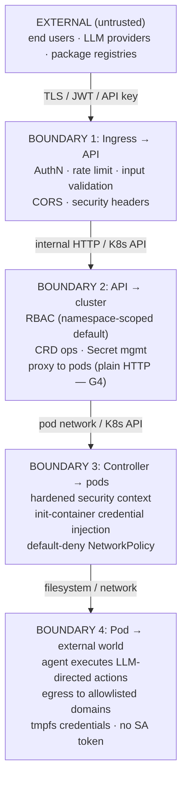

# Threat Model

This page summarizes the STRIDE analysis and the gap register (G1–G50) for LLMSafeSpaces. The authoritative source is [`design/stories/epic-17-security-review/THREAT-MODEL.md`](https://github.com/lenaxia/LLMSafeSpaces/blob/main/design/stories/epic-17-security-review/THREAT-MODEL.md); this page is a rendered summary for operators and integrators.

**Be honest about what's open.** The platform is suitable for homelab and small-team deployments with the threat model understood. It is **not** recommended for public multi-tenant SaaS without reviewing the remaining open security gaps below.

## Trust boundaries

## Assets

| Asset | Sensitivity | Location | Impact if compromised |
|---|---|---|---|
| User LLM API keys | Critical | K8s Secret → tmpfs in pod | Financial loss, unauthorized API usage |
| User SSH keys / Git tokens | Critical | K8s Secret → tmpfs | Source code theft, supply chain attack |
| User DEK | Critical | Redis session cache (memory) | All user secrets decryptable |
| User password hash (bcrypt cost 12) | High | PostgreSQL | Offline brute-force → credential access |
| JWT signing key | Critical | API config / Secret | Full impersonation of any user |
| Master KEK (root of trust) | Critical | File mount (US-50.1 default, mode 0440); legacy env var is deprecated opt-in | All at-rest platform credentials decryptable |
| Workspace PVC data | Medium | Kubernetes PV | User code/data exposure |
| etcd data (K8s Secrets at rest) | Critical | etcd | All credentials if unencrypted |

## Threat actors

| Actor | Capability | Motivation |
|---|---|---|
| Malicious user | Authenticated, owns workspaces | Escape sandbox, access other tenants, steal credentials |
| Compromised agent | Code execution inside pod | Exfiltrate data, pivot to cluster, mine crypto |
| Malicious LLM output | Prompt injection via tool responses | Manipulate agent to exfiltrate/escalate |
| Network attacker | MITM on pod-to-pod traffic (G4: plain HTTP) | Credential interception |
| Compromised API server | Full API memory + DB access | Access active session DEKs, impersonate users |
| Compromised controller | K8s SA with Secret/Pod CRUD (namespace-scoped) | Read credentials, create pods |
| Cluster admin (insider) | kubectl access | Read Secrets, exec into pods |
| Supply chain attacker | Compromised opencode binary / Go dependency | Backdoor in all pods |

## STRIDE analysis

| Component | Spoofing | Tampering | Repudiation | Info Disclosure | DoS | Elevation |
|---|---|---|---|---|---|---|
| **API Auth** | JWT forgery (mitigated: HMAC-only); API key theft | Token replay (mitigated: dual-key revocation) | No audit of failed auth | Secret values logged unredacted (**G25**) | Account lockout abuse (**G13**); no rate limit on recovery (**G35**) | Sessions survive password change (**G38**) |
| **Proxy** | Workspace ID spoofing — **fixed** (G33) | Response tampering (plain HTTP — G4); header injection — **fixed** (G34) | No per-request audit | Headers to sandbox — **fixed** (G34 allowlist) | Connection exhaustion (mitigated: limits) | Cross-tenant access — **fixed** (G33) |
| **Controller** | SA token theft (mitigated: bound tokens) | CRD manipulation (mitigated: webhooks) | Actions not individually audited | Namespace-scoped default; secrets persist after deletion (**G36**) | CRD spam (mitigated: quotas) | Namespace-scoped SA |
| **Sandbox Pod** | N/A | PVC data corruption | No file-level audit | Credential in env (**G3** accepted); env var injection (**G37**); agentd user port unauthenticated (**G40**) | Resource exhaustion (mitigated) | Container escape (mitigated: seccomp, caps; G1 accepted) |
| **Database** | SQL injection (mitigated: pgx parameterized) | Data corruption (mitigated: tx) | No query audit | Wrapped DEK exposure (mitigated: AES-256-GCM); `key_version` for rotation; authorized-decrypt exfil undetectable (**G50**) | Connection exhaustion | N/A |
| **Redis** | Auth bypass (mitigated: auto-gen password + NP) | Cache poisoning | No op audit | DEK in memory (**G10** accepted) | Memory exhaustion; SSE tracking leak (**G42**) | N/A |
| **Frontend** | Session theft via XSS (mitigated: rehype-sanitize — needs fuzzing) | DOM tampering (mitigated: React auto-escape) | No client audit | JWT in HttpOnly Secure cookie | UI freeze via huge messages | N/A |
| **Workspace Network** | Cross-tenant traffic (mitigated: NP) | N/A | NP events not audited | DNS exfil via external resolvers (**G30**); IPv6 unrestricted (**G43**) | N/A | N/A |

## The gap register (G1–G50)

**Status:** 21 Fixed · 22 Open · 7 Accepted (50 total).

### Critical recent closures

Four high-impact gaps closed in the v0.3.0 network hardening sweep:

| # | Gap | Severity | Fix |
|---|---|---|---|
| **G33** | Proxy routes had no workspace ownership check (IDOR) — any authenticated user could proxy to any workspace ID | Critical | `WorkspaceAccessMiddleware` wired on the `idGroup` route group, which all proxy routes inherit. Resolves workspace, checks `WorkspaceOwner{UserID, OrgID}`, rejects 403 on mismatch. Regression: `router_workspace_access_test.go`. |
| **G34** | Proxy forwarded all client headers (Cookie, Origin, Referer, X-Forwarded-*, custom) to the sandbox pod | Critical | `copyRequestHeaders` explicit allowlist (`Content-Type`, `Accept`, `X-Request-ID`); hop-by-hop headers stripped both directions; `Accept-Encoding` deliberately not forwarded. Regression: `TestProxy_G34_*`. (PR #513) |
| **G39** | Terminal WebSocket accepted any Origin (`CheckOrigin: return true`) — cross-site WebSocket hijacking | Medium | `newCheckOriginChecker`: same-origin default + operator allowlist via `terminal.allowedOrigins`. Dead `WebSocketSecurityMiddleware` removed; gorilla `Upgrader` is the single enforcement point. (PR #515) |
| **G49** | No operational KEK rotation — rotating the master KEK orphaned every Postgres ciphertext | High | Foundation shipped (multi-key `StaticKeyProvider`, `key_version` columns, rotation-aware write path) + the `rotate-kek` CLI at `cmd/rotate-kek/main.go`. |

Plus the earlier master-KEK hardening:

| # | Gap | Severity | Fix |
|---|---|---|---|
| **G48** | Master KEK delivered as env var (exposed via `/proc/1/environ`) | High | US-50.1: default delivery is a read-only file mount at `/var/run/secrets/llmsafespaces/master-secret` (mode 0440). Env path is deprecated opt-in. |

### Still open — highest severity

These are the gaps to prioritize if you're hardening a deployment:

| # | Gap | Severity | Detail |
|---|---|---|---|
| **G35** | `RecoverAccount` endpoint has no rate limiting | High | `router.go:264` — outside the auth rate limiter; requires only userID + recovery key. Move behind auth rate limiter. |
| **G36** | Workspace secrets not cleaned on deletion | High | `phase_terminating.go` only deletes `workspace-pw-*`; `workspace-secrets-*` and `workspace-creds-*` persist indefinitely. Call `deleteEphemeralSecretsSecret` from `handleTerminating`. |
| **G37** | No validation on workspace env var names | High | `secrets.go:573` accepts `LD_PRELOAD`, `PATH`, `PYTHONPATH`, etc. as env var names. Add blocklist. |
| **G38** | `ChangePassword` does not invalidate existing sessions | High | `secrets.go:782-817` updates bcrypt and re-wraps DEK but never calls `RevokeToken`; existing JWTs remain valid. Revoke all active sessions on password change. |
| **G25** | Secret value field logged unredacted | High | `logging.go:48` — `SensitiveFields` doesn't include `"value"`. Add it, route JSON through `pkg/redact.Redact()`, or disable body logging for `/api/v1/secrets/*`. |
| **G50** | Decrypt operations are not audited | Medium | `NewAuditedProvider` exists but has zero production call sites. Wiring awaits US-50.2 (unify crypto layers — `AdminKeyDeriver` removal). Currently `secret_audit_log` records only CRUD, not decrypts. |
| **G4** | No mTLS between API and sandbox pods | Medium | Plain HTTP `http://{pod_ip}:4096`. Implement mTLS via per-workspace cert or service mesh. |
| **G9** | opencode/gh binaries downloaded without checksum verification | Medium | Dockerfile uses `curl --fail` over TLS only; no checksum or Sigstore. opencode upstream doesn't publish checksums; gh does (`.sha256`) — should verify. Release images are cosign-signed so image-level provenance is verifiable; individual binary verification is the remaining gap. |
| **G13** | Account lockout keyed on email only | Medium | `lockoutKey := lockout:%s` keyed on email — attacker who knows victim email can lock them out from any IP. Add IP component or progressive delays + CAPTCHA. |
| **G30** | Egress NetPol allows external DNS resolvers (e.g. 8.8.8.8:53) | Medium | DNS-to-kube-dns and `0.0.0.0/0 except RFC1918` rules are OR-ed; enables DNS exfil/tunneling. Use Cilium FQDN policies or Calico GlobalNetworkPolicy. |

### Full open gap list

G4, G6, G9, G13, G21, G25, G28, G29, G30, G35, G36, G37, G38, G40, G41, G42, G43, G44, G45, G46, G47, G50.

### Accepted risks

These are documented with rationale and compensating controls:

| # | Gap | Rationale |
|---|---|---|
| **G1** | No `noexec` on emptyDir mounts | K8s doesn't support `noexec` on emptyDir natively. Mitigated by RuntimeDefault seccomp + Drop ALL caps + NoNewPrivs + tmpfs. |
| **G3** | env-secret readable via `/proc/self/environ` | Accepted; prefer `secret-file` type; documented for operators. |
| **G7** | SSE streams bypass injection-detection blocking | SSE is unidirectional; block action applies to non-streaming JSON responses only. |
| **G10** | Redis session cache not encrypted at rest | Operator responsibility: disable RDB/AOF persistence or enable disk encryption. |
| **G14** | No egress request body inspection | Accepted residual risk; minimize `allowedDomains`; document. |
| **G23** | `/workspace` PVC mount lacks `nosuid` | Operator responsibility via StorageClass mountOptions. Mitigated by runAsNonRoot + NoNewPrivs + cap-drop ALL. |
| **G32** | No per-user workspace quota | Intentional for single-tenant. Multi-tenant SaaS should add `MAX_WORKSPACES_PER_USER`. |

## What the platform protects against

- **Cross-tenant workspace access via the API** — ownership check on every call (G33 fixed); UUIDv4 IDs are unguessable.
- **Credential theft from the database** — encryption at rest; user secrets need the password, platform secrets need the master KEK.
- **Credential theft from PVC at rest** — tmpfs + symlinks; PVC retains only dangling symlinks, no plaintext bytes.
- **Master KEK exposure via `/proc/1/environ`** — file mount default (G48 fixed).
- **Container escape to the node** — Drop ALL caps, NoNewPrivs, RuntimeDefault seccomp, read-only root; optional gVisor for kernel-level isolation.
- **Cross-tenant network access** — default-deny ingress NetworkPolicy; RFC1918/CGNAT/cloud-metadata-filtered egress.
- **SA token abuse from within a pod** — `AutomountServiceAccountToken: false`.
- **Header injection to the sandbox pod** — explicit proxy allowlist (G34 fixed).
- **Cross-site WebSocket hijacking** — same-origin terminal upgrade check (G39 fixed).
- **Forged JWTs** — HMAC-only signing enforced (alg-confusion check); `iss`/`aud` claims minted and validated.
- **JWT replay after revocation** — dual-key revocation (`token:<jti>` + `token:<hash>`).
- **Default DB/Redis passwords** — auto-generated 32-char random on install (G26 fixed).

## What it does NOT protect against

- **API-pod RCE → mass credential decrypt** (with local KEK providers) — an attacker running code in the pod calls `Decrypt` exactly as the application does. KMS (Epic 57) limits this to exfiltration-limitation + audit, not prevention.
- **DNS exfiltration/tunneling** (G30) — external DNS resolvers are reachable on port 53.
- **IPv6 egress** (G43) — the workspace NetworkPolicy CIDR allowlist is IPv4-only.
- **Egress request-body inspection** (G14) — no code path inspects outbound HTTP bodies; a compromised agent can exfiltrate via allowed egress domains.
- **Audit of decrypt operations** (G50) — `secret_audit_log` records CRUD only; authorized decrypts are not individually attributable.
- **Compromised opencode binary** (G9) — no checksum/Sigstore verification on download.
- **A cluster admin / insider** — out of scope. A cluster admin can read Secrets and exec into pods by design.
- **etcd-at-rest compromise without encryption configured** (A1) — operator MUST configure etcd encryption; no chart guard enforces it.

## Assumptions operators must validate

| # | Assumption | Status |
|---|---|---|
| A1 | etcd encryption at rest enabled | **Unvalidated** — no chart guard. Document requirement. |
| A2 | NetworkPolicy CNI installed and functioning | Validated (chart ships NPs; `networkPolicy.enabled: true` default). No preflight that the CNI actually enforces. |
| A3 | Node OS patched, container runtime current | Unvalidated — operator responsibility. |
| A4 | TLS termination at ingress | Validated (`tls: true` default for frontend ingress). |
| A5/A6 | Redis/PostgreSQL not exposed outside the cluster | Validated (no Service created; datastore NetworkPolicy restricts ingress). |
| A7 | Container images from a trusted registry | Partial — release images cosign-signed (keyless OIDC + Rekor); Dockerfile FROMs tag-pinned (Renovate `docker:pinDigests` opens digest-pinning PRs); opencode/gh downloaded over TLS without checksum (G9). Trivy image scanning on every release. |
| A8 | JWT signing keys rotated periodically | Refuted (no rotation primitives — restart-with-new-secret only). KEK rotation: supported end-to-end (`rotate-kek` CLI shipped). |

## Out of scope

- LLM provider security (operator selects providers)
- opencode binary internals (upstream — pin version, track CVEs)
- Physical / social engineering
- etcd encryption at rest (K8s operator — A1)
- Node OS hardening (cluster admin — A3)
- gVisor runtime availability (cluster admin — optional defense-in-depth)
