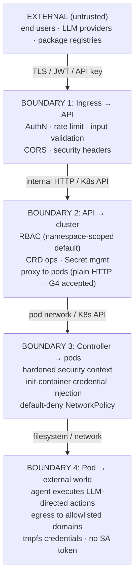

# Threat Model

This page summarizes the STRIDE analysis and the gap register (G1–G50) for LLMSafeSpaces. The authoritative source is [`design/stories/epic-17-security-review/THREAT-MODEL.md`](https://github.com/lenaxia/LLMSafeSpaces/blob/main/design/stories/epic-17-security-review/THREAT-MODEL.md); this page is a rendered summary for operators and integrators.

**Be honest about what's open.** The platform is suitable for homelab and small-team deployments with the threat model understood. It is **not** recommended for public multi-tenant SaaS without reviewing the remaining open security gaps below.

## Trust boundaries

## Assets

| Asset | Sensitivity | Location | Impact if compromised |
|---|---|---|---|
| User LLM API keys | Critical | K8s Secret → tmpfs in pod | Financial loss, unauthorized API usage |
| User SSH keys / Git tokens | Critical | K8s Secret → tmpfs | Source code theft, supply chain attack |
| User DEK | Critical | Redis session cache (memory) | All user secrets decryptable |
| User password hash (bcrypt cost 12) | High | PostgreSQL | Offline brute-force → credential access |
| JWT signing key | Critical | API config / Secret | Full impersonation of any user |
| Master KEK (root of trust) | Critical | File mount (US-50.1 default, mode 0440); legacy env var is deprecated opt-in | All at-rest platform credentials decryptable |
| Workspace PVC data | Medium | Kubernetes PV | User code/data exposure |
| etcd data (K8s Secrets at rest) | Critical | etcd | All credentials if unencrypted |

## Threat actors

| Actor | Capability | Motivation |
|---|---|---|
| Malicious user | Authenticated, owns workspaces | Escape sandbox, access other tenants, steal credentials |
| Compromised agent | Code execution inside pod | Exfiltrate data, pivot to cluster, mine crypto |
| Malicious LLM output | Prompt injection via tool responses | Manipulate agent to exfiltrate/escalate |
| Network attacker | MITM on pod-to-pod traffic (G4: plain HTTP, accepted) | Credential interception |
| Compromised API server | Full API memory + DB access | Access active session DEKs, impersonate users |
| Compromised controller | K8s SA with Secret/Pod CRUD (namespace-scoped) | Read credentials, create pods |
| Cluster admin (insider) | kubectl access | Read Secrets, exec into pods |
| Supply chain attacker | Compromised opencode binary / Go dependency | Backdoor in all pods |

## STRIDE analysis

| Component | Spoofing | Tampering | Repudiation | Info Disclosure | DoS | Elevation |
|---|---|---|---|---|---|---|
| **API Auth** | JWT forgery (mitigated: HMAC-only); API key theft | Token replay (mitigated: dual-key revocation) | No audit of failed auth | Secret values logged — **fixed** (G25, two-layer mask + skip) | Account lockout abuse — **fixed** (G13 email+IP keying); recovery rate limit — **fixed** (G35) | Sessions survive password change — **fixed** (G38 revokes all sessions) |
| **Proxy** | Workspace ID spoofing — **fixed** (G33) | Response tampering (plain HTTP — G4 accepted); header injection — **fixed** (G34) | No per-request audit | Headers to sandbox — **fixed** (G34 allowlist) | Connection exhaustion (mitigated: limits) | Cross-tenant access — **fixed** (G33) |
| **Controller** | SA token theft (mitigated: bound tokens) | CRD manipulation (mitigated: webhooks) | Actions not individually audited | Secrets persist after deletion — **fixed** (G36 cleanup) | CRD spam (mitigated: quotas) | Namespace-scoped SA |
| **Sandbox Pod** | N/A | PVC data corruption | No file-level audit | Credential in env (**G3** accepted); env var injection — **fixed** (G37 blocklist); agentd user port unauthenticated (**G40** accepted) | Resource exhaustion (mitigated) | Container escape (mitigated: seccomp, caps; G1 accepted) |
| **Database** | SQL injection (mitigated: pgx parameterized) | Data corruption (mitigated: tx) | No query audit | Wrapped DEK exposure (mitigated: AES-256-GCM); `key_version` for rotation; authorized-decrypt exfil — **fixed** (G50 AuditedProvider wired) | Connection exhaustion | N/A |
| **Redis** | Auth bypass (mitigated: auto-gen password + NP) | Cache poisoning | No op audit | DEK in memory (**G10** accepted) | Memory exhaustion; SSE tracking leak — **fixed** (G42 prunes) | N/A |
| **Frontend** | Session theft via XSS (mitigated: rehype-sanitize — needs fuzzing) | DOM tampering (mitigated: React auto-escape) | No client audit | JWT in HttpOnly Secure cookie | UI freeze via huge messages | N/A |
| **Workspace Network** | Cross-tenant traffic (mitigated: NP) | N/A | NP events not audited | DNS exfil via external resolvers (**G30** accepted); IPv6 denied by default-deny (**G43** fixed) | N/A | N/A |

## The gap register (G1–G50)

**Status:** 38 Fixed · 0 Open · 12 Accepted (50 total). See the authoritative [`THREAT-MODEL.md`](https://github.com/lenaxia/LLMSafeSpaces/blob/main/design/stories/epic-17-security-review/THREAT-MODEL.md) for the full per-gap evidence and regression-test references; the summaries below hit the high points.

### Critical and High-severity closures (recent)

The 2026-07-11 security sweep closed every High-severity gap that had a code-side fix:

| # | Gap | Severity | Fix |
|---|---|---|---|
| **G33** | Proxy routes had no workspace ownership check (IDOR) | Critical | `WorkspaceAccessMiddleware` wired on the `idGroup`; resolves workspace, checks `WorkspaceOwner`, rejects 403 on mismatch. |
| **G34** | Proxy forwarded all client headers (Cookie, Origin, Referer, X-Forwarded-*, custom) to the sandbox pod | Critical | `copyRequestHeaders` explicit allowlist (`Content-Type`, `Accept`, `X-Request-ID`); hop-by-hop stripped both directions. (PR #513) |
| **G38** | `ChangePassword` did not invalidate existing sessions | High | Handler now calls `auth.Service.RevokeAllUserSessions` after DEK re-wrap + bcrypt commit. Best-effort; mirrors password-reset. (PR #536) |
| **G37** | Workspace env-var names not validated — `LD_PRELOAD`, `PATH`, `PYTHONPATH`, etc. accepted | High | New `pkg/validation.ValidateEnvVarName`: POSIX shape + length + curated blocklist of ~30 dangerous names (ld.so, bash, Python, Node, Ruby, Perl, Java, glibc docs). API and agentd both enforce. (PR #537) |
| **G35** | `/account/recover` had no per-endpoint rate limit (CPU-exhaustion DoS target) | High | New `PerRouteRateLimitMiddleware` with per-route bucket isolation. Per-window rate conversion (`Limit / Window.Seconds()`). (PR #538) |
| **G25** | Secret `value` field logged unredacted in API request bodies | High | Two-layer fix: added `"value"` to `SensitiveFields`; added `SkipPathPrefixes` to `LoggingConfig` for credential-bearing paths. (PR #539) |
| **G36** | Workspace secrets not cleaned on deletion (`workspace-creds-*` persisted indefinitely) | High | `handleTerminating` now calls `cleanupFailedWorkspaceSecrets`. (PR #540) |
| **G28** | Workspace bind handler "no-op for first-time delivery" | High | **Reclassified Accepted** — Epic 35 (secretless injection) intentionally defers first-time delivery to pod boot. Bindings are durable in PostgreSQL; bootstrap reads them at boot. (PR #541) |
| **G48** | Master KEK delivered as env var (exposed via `/proc/1/environ`) | High | US-50.1: default delivery is a read-only file mount at `/var/run/secrets/llmsafespaces/master-secret` (mode 0440). Env path is deprecated opt-in. |
| **G49** | No operational KEK rotation — rotating the master KEK orphaned every Postgres ciphertext | High | Foundation shipped (multi-key `StaticKeyProvider`, `key_version` columns, rotation-aware write path) + the `rotate-kek` CLI at `cmd/rotate-kek/main.go`. |

### Medium-severity closures (recent)

| # | Gap | Fix |
|---|---|---|
| **G6 / G41** (duplicate) | `/secrets/:id/reveal` no per-endpoint rate limit | Added to `PerRouteRateLimitConfig.Routes` (5/min + burst 5). (PR #543) |
| **G21** | `/sandbox-cfg/password` mode 0644 | `cp` → `install -m 0600` in init-container credScript. (PR #543) |
| **G42** | SSE connection tracking unbounded memory growth | Opportunistic prune in `sseConnAllowed` on every call. (PR #543) |
| **G13** | Account lockout keyed on email only (DoS vector) | Lockout key now includes client IP via `WithClientIP` context helper. An attacker from a different IP cannot trigger the victim's lockout. |
| **G39** | Terminal WebSocket accepted any Origin | `newCheckOriginChecker`: same-origin default + operator allowlist. (PR #515) |
| **G29** | Path-traversal `mount_path` accepted by API | `validateMountPath` at `secret_service.go:582` rejects; called from CreateSecret. (Already fixed — threat model corrected) |
| **G50** | Decrypt operations not audited | `AuditedProvider` wired at `app.go:408,409,624`. (Already fixed — threat model corrected) |

### Low-severity closures (recent)

| # | Gap | Fix |
|---|---|---|
| **G44** | Pod-level SecurityContext missing RunAsNonRoot | Added `RunAsNonRoot: &true` to `buildPodSecurityContext`. (PR #543) |
| **G46** | Silent password file read failure | `readAgentPassword` now Error + `os.Exit(1)`. (PR #543) |
| **G47** | Inference relay secret exposed as CLI arg | Removed plaintext fallback; `{{ fail }}` at helm-template-time. (PR #543) |
| **G45** | Legacy `source /sandbox-cfg/env` in entrypoint | US-35.7 moved source path. (Already fixed — threat model corrected) |

### Still open

**No open gaps remain.** All 50 gaps have a disposition:

- 38 Fixed (code + regression test)
- 12 Accepted (documented rationale + compensating controls)

The most recent closures: G13 (lockout IP+email keying), G43 (IPv6 already denied by default-deny), G9 (gh CLI checksum added; opencode upstream doesn't publish checksums — Accepted).

### Full open gap list

_(No open gaps.)_ All 50 resolved: 38 Fixed · 0 Open · 12 Accepted.

### Accepted risks

These are documented with rationale and compensating controls:

| # | Gap | Rationale |
|---|---|---|
| **G1** | No `noexec` on emptyDir mounts | K8s doesn't support `noexec` on emptyDir natively. Mitigated by RuntimeDefault seccomp + Drop ALL caps + NoNewPrivs + tmpfs. |
| **G3** | env-secret readable via `/proc/self/environ` | Accepted; prefer `secret-file` type; documented for operators. |
| **G4** | No mTLS between API and sandbox pods | Requires service mesh (Linkerd/Istio) or per-workspace cert infrastructure. Compensating controls: NetworkPolicy default-deny, RFC1918/CGNAT egress filter, explicit header allowlist (G34), per-request basic-auth. Operator runbook: deploy Linkerd/Istio in `inject` mode. |
| **G7** | SSE streams bypass injection-detection blocking | SSE is unidirectional; block action applies to non-streaming JSON responses only. |
| **G10** | Redis session cache not encrypted at rest | Operator responsibility: disable RDB/AOF persistence or enable disk encryption. |
| **G14** | No egress request body inspection | Accepted residual risk; minimize `allowedDomains`; document. |
| **G23** | `/workspace` PVC mount lacks `nosuid` | Operator responsibility via StorageClass mountOptions. Mitigated by runAsNonRoot + NoNewPrivs + cap-drop ALL. |
| **G28** | Workspace bind handler defers first-time delivery to pod boot | Architecture (Epic 35 secretless injection): bindings persist to PostgreSQL; bootstrap reads them at pod boot. Live HTTP push is best-effort. |
| **G30** | Egress NetPol allows external DNS resolvers | Standard `NetworkPolicy` cannot restrict DNS by domain. Requires Cilium FQDN policies or Calico `GlobalNetworkPolicy`. |
| **G32** | No per-user workspace quota | Intentional for single-tenant. Multi-tenant SaaS should add `MAX_WORKSPACES_PER_USER`. |
| **G40** | Agentd user port (4097) has no application-layer auth | NetworkPolicy is the documented trust boundary — only API server pods can reach workspace pods on port 4097. Application-layer auth would be defense-in-depth that existing controls make redundant for documented deployment topologies. |
| **G9** | opencode binary not checksum-verified | opencode upstream doesn't publish checksums or Sigstore signatures. gh CLI is now checksum-verified via `checksums.txt`. Compensating controls: cosign-signed release images, Trivy scanning, Renovate digest-pinning. |

## What the platform protects against

- **Cross-tenant workspace access via the API** — ownership check on every call (G33 fixed); UUIDv4 IDs are unguessable.
- **Credential theft from the database** — encryption at rest; user secrets need the password, platform secrets need the master KEK.
- **Credential theft from PVC at rest** — tmpfs + symlinks; PVC retains only dangling symlinks, no plaintext bytes.
- **Master KEK exposure via `/proc/1/environ`** — file mount default (G48 fixed).
- **Container escape to the node** — Drop ALL caps, NoNewPrivs, RuntimeDefault seccomp, read-only root; pod-level RunAsNonRoot (G44 fixed); optional gVisor for kernel-level isolation.
- **Cross-tenant network access** — default-deny ingress NetworkPolicy; RFC1918/CGNAT/cloud-metadata-filtered egress.
- **SA token abuse from within a pod** — `AutomountServiceAccountToken: false`.
- **Header injection to the sandbox pod** — explicit proxy allowlist (G34 fixed).
- **Cross-site WebSocket hijacking** — same-origin terminal upgrade check (G39 fixed).
- **Forged JWTs** — HMAC-only signing enforced (alg-confusion check); `iss`/`aud` claims minted and validated.
- **JWT replay after revocation** — dual-key revocation (`token:<jti>` + `token:<hash>`); password change revokes all sessions (G38 fixed).
- **Default DB/Redis passwords** — auto-generated 32-char random on install (G26 fixed).
- **Plaintext credential in API logs** — SensitiveFields mask + SkipPathPrefixes (G25 fixed).
- **Dangerous workspace env-var names** — POSIX + curated blocklist enforced at API and materialize layers (G37 fixed).
- **Recovery-endpoint CPU-exhaustion** — per-route rate limit at 20/min + burst 5 (G35 fixed).
- **Workspace secrets outliving deletion** — handleTerminating cleans up all ephemeral secrets (G36 fixed).
- **Account-lockout DoS amplification** — lockout keys on email + client IP so an attacker from a different IP cannot lock the victim (G13 fixed).
- **Pod-level privilege escalation** — pod-level `RunAsNonRoot` set structurally, not just per-container (G44 fixed).
- **Password file world-readable in pod** — `install -m 0600` replaces `cp` (G21 fixed).
- **Silent workspace boot failure** — password-read errors are now fatal (Error + os.Exit) instead of silently degraded (G46 fixed).

## What it does NOT protect against

- **API-pod RCE → mass credential decrypt** (with local KEK providers) — an attacker running code in the pod calls `Decrypt` exactly as the application does. KMS (Epic 57) limits this to exfiltration-limitation + audit, not prevention.
- **MITM on pod-to-pod traffic** (G4 accepted) — proxy uses plain HTTP to workspace pods. Deploy a service mesh to close.
- **DNS exfiltration/tunneling** (G30 accepted) — external DNS resolvers are reachable on port 53. Use Cilium FQDN or Calico GlobalNetworkPolicy.
- **Egress request-body inspection** (G14 accepted) — no code path inspects outbound HTTP bodies; a compromised agent can exfiltrate via allowed egress domains.
- **Compromised opencode binary** (G9 accepted) — opencode upstream doesn't publish checksums; gh CLI is verified. Release images are cosign-signed.
- **A cluster admin / insider** — out of scope. A cluster admin can read Secrets and exec into pods by design.
- **etcd-at-rest compromise without encryption configured** (A1) — operator MUST configure etcd encryption; no chart guard enforces it.

## Assumptions operators must validate

| # | Assumption | Status |
|---|---|---|
| A1 | etcd encryption at rest enabled | **Unvalidated** — no chart guard. Document requirement. |
| A2 | NetworkPolicy CNI installed and functioning | Validated (chart ships NPs; `networkPolicy.enabled: true` default). No preflight that the CNI actually enforces. |
| A3 | Node OS patched, container runtime current | Unvalidated — operator responsibility. |
| A4 | TLS termination at ingress | Validated (`tls: true` default for frontend ingress). |
| A5/A6 | Redis/PostgreSQL not exposed outside the cluster | Validated (no Service created; datastore NetworkPolicy restricts ingress). |
| A7 | Container images from a trusted registry | Partial — release images cosign-signed (keyless OIDC + Rekor); Dockerfile FROMs tag-pinned (Renovate `docker:pinDigests` opens digest-pinning PRs); opencode downloaded over TLS without checksum (G9 accepted — upstream doesn't publish checksums); gh CLI checksum-verified via `checksums.txt` (G9 partial fix). Trivy image scanning on every release. |
| A8 | JWT signing keys rotated periodically | Refuted (no rotation primitives — restart-with-new-secret only). KEK rotation: supported end-to-end (`rotate-kek` CLI shipped). |

## Out of scope

- LLM provider security (operator selects providers)
- opencode binary internals (upstream — pin version, track CVEs)
- Physical / social engineering
- etcd encryption at rest (K8s operator — A1)
- Node OS hardening (cluster admin — A3)
- gVisor runtime availability (cluster admin — optional defense-in-depth)
