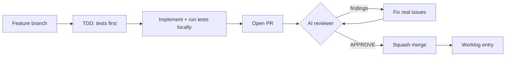

# Contributing

LLMSafeSpaces is built with significant LLM assistance — most code is written by AI agents (notably `opencode`, which the project dogfoods) and reviewed by humans and AI reviewers before merge. This page explains the development model and how to contribute effectively.

## The development model

- **LLM-assisted, opencode dogfooded.** The project uses its own platform to build itself. Agents work in workspaces, follow the engineering rules, and produce code + tests + worklogs.
- **Human-in-the-loop.** Humans direct work, review PRs, and make architectural calls. The AI reviewer (which triggers on every PR) and a human reviewer must both approve before merge.
- **Institutional memory via worklogs.** Every substantive session produces a worklog entry. Worklogs are the project's memory across context windows — see [Worklogs](worklogs.md).
- **Quality gates are non-negotiable.** TDD, type safety, the engineering rules, and the PR review rubric apply equally to humans and agents. There is no "good enough" exit from the validator loop.

## Branch and PR workflow

Every change — no matter how small — follows this cycle. **Never push directly to `main`.**

1. **Create a feature branch** from `main`. Use a `feat/`, `fix/`, `test/`, `chore/`, or `security/` prefix.
2. **Do the work** — TDD, write code, run tests locally.
3. **Push the branch and open a PR.**
4. **Wait for the automated review** — the AI reviewer triggers on every PR open and push.
5. **Read every finding.** Fix all real issues. Push to the same branch (triggers re-review).
6. **Iterate** — repeat steps 4–5 until the automated reviewer posts **APPROVE**.
7. **Merge** — only after approval. Use **squash merge**.
8. **Write a worklog entry** if the session was substantive.

This applies to humans and AI agents equally. No exceptions. The review-iterate-approve-merge cycle is the quality gate — skipping it defeats the purpose of having it.

!!! warning "Never force push without explicit permission"
    Never use `git push --force` or `git push --force-with-lease` unless the user has explicitly told you it is okay. Force pushing rewrites shared history and can destroy a collaborator's work. Prefer `git pull --rebase` + a normal push. See [Rule 10](rules.md#rule-10-never-force-push-without-explicit-permission) in the engineering rules.

## What makes a good contribution

A good change:

- **Follows TDD.** Tests are written before the code and must fail first, then pass. "It compiles" or "unit tests pass" is not the definition of done — the change must be wired into the live request path and demonstrated by passing integration/e2e tests.
- **Is typed.** Strongly-typed structs for all data; no `map[string]interface{}` for structured data. See [Rule 1](rules.md#rule-1-type-safety-first).
- **Leaves zero technical debt.** No TODOs, no hacks, no workarounds, no speculative abstractions. Pre-existing errors are fixed, not tolerated. See [Rule 5](rules.md#rule-5-zero-technical-debt).
- **States and validates its assumptions.** Every non-trivial change rests on assumptions about the system. State them up front and prove them true. See [Rule 7](rules.md#rule-7-assumptions-state-then-validate).
- **Includes a worklog.** Document what was done, why, what was decided, what's blocked, and what's next. See [Worklogs](worklogs.md).

## Where to start

| You want to... | Start here |
|----------------|------------|
| Run the project locally | [Development Workflow](development.md) |
| Understand the engineering bar | [Engineering Rules](rules.md) |
| Learn the test patterns | [Testing](testing.md) |
| Write your first worklog | [Worklogs](worklogs.md) |
| Keep the docs site from drifting | [Docs Maintenance](docs-maintenance.md) |
| Understand the architecture | [Architecture Overview](../architecture/index.md) |
| See the API surface | [REST API](../api/rest.md) |

## Reading order for new contributors

1. This page (development model + PR workflow)
2. [Development Workflow](development.md) — get a local environment running
3. [Engineering Rules](rules.md) — the non-negotiable bar every change must meet
4. [Testing](testing.md) — TDD, table-driven tests, the test helpers, the cover floor
5. [Worklogs](worklogs.md) — how institutional memory works
6. The relevant design doc(s) from `design/` for the area you're touching (see [Rule 8](rules.md#rule-8-understand-the-architecture-first))

## Multi-agent workflow

For epic-scale work, the project defines an Orchestrator/Delegation agent pattern with a mandatory skeptical-validator loop. This is how large features get built across multiple `api/`, `controller/`, `pkg/`, and `runtimes/` boundaries. The full workflow is documented in `README-LLM.md` under "Multi-Agent Workflow"; the essence:

- The **Orchestrator** coordinates, distributes context, enforces quality, and validates integration.
- The **Delegation agent** executes scoped tasks (implementation, tests, code review).
- A **separate skeptical validator** (not the implementer) reviews every change and must return zero real findings before the work proceeds. This is the [Adversarial Self-Review](rules.md#rule-11-adversarial-self-review) rule applied to delegation.

## Communication tone

Contributions and reviews should be neutral, factual, and objective — not sensational or sycophantic. Provide honest and critical feedback. Validate claims with evidence before stating them. See [Rule 9](rules.md#rule-9-communication-tone).

## Next

- [Development Workflow](development.md) — clone, bootstrap, test, iterate
- [Engineering Rules](rules.md) — the 13 critical guidelines
