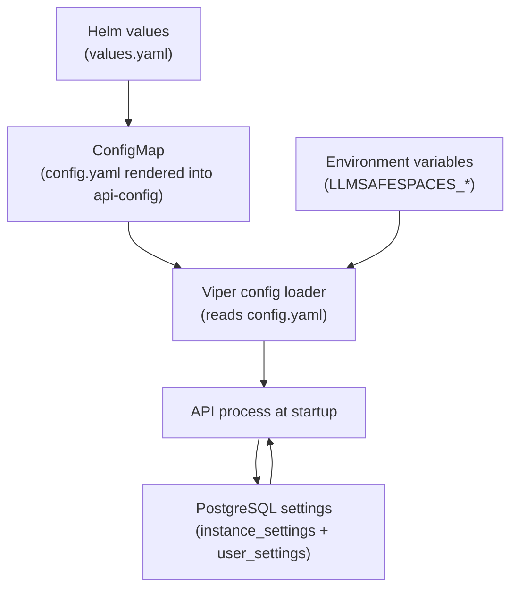
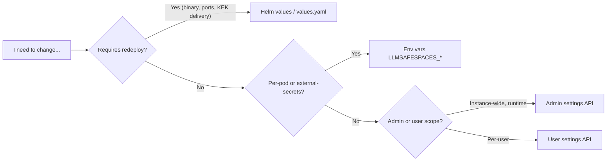

# Configuration

This page is a deep dive into how LLMSafeSpaces is configured: the layered ConfigMap structure rendered by Helm, the `LLMSAFESPACES_*` environment-variable overrides, the runtime settings system (admin instance settings + per-user settings), and when to use each layer. The platform uses Viper for config loading, a PostgreSQL-backed settings service for runtime-mutable values, and a set of tiered precedence rules that determine which value wins when they conflict.

## On this page

- [The configuration layers](#the-configuration-layers)
- [The ConfigMap (Helm-rendered)](#the-configmap-helm-rendered)
- [Environment-variable overrides](#environment-variable-overrides)
- [The settings system](#the-settings-system)
- [Helm overrides for settings](#helm-overrides-for-settings)
- [When to use each layer](#when-to-use-each-layer)
- [Common configuration recipes](#common-configuration-recipes)

---

## The configuration layers

LLMSafeSpaces resolves configuration from three independent layers, each with a distinct lifetime and audience:



| Layer | Lifetime | Audience | Precedence |
|---|---|---|---|
| **Helm values** → ConfigMap | Deploy-time (requires `helm upgrade`) | Operator | Base config |
| **Env vars** (`LLMSAFESPACES_*`) | Pod-restart | Operator / per-pod | Overrides ConfigMap (Viper `AutomaticEnv`) |
| **Settings** (PostgreSQL) | Runtime (no restart) | Admin (instance) / user | Highest for the keys it manages |

The key insight: **most configuration is static and deploy-time**, but a carefully chosen subset is **runtime-mutable via the settings API** so operators do not need a redeploy to tune rate limits, default storage size, or feature flags.

---

## The ConfigMap (Helm-rendered)

The chart renders a ConfigMap from the `api.config` block in `values.yaml`. The template lives at [`helm/templates/configmap-api.yaml`](https://github.com/lenaxia/LLMSafeSpaces/blob/main/helm/templates/configmap-api.yaml) and produces a `config.yaml` mounted into the API pod.

```yaml
api:
  config:
    server:
      host: "0.0.0.0"
      port: 8080
      shutdownTimeout: 30s
    kubernetes:
      inCluster: true
      namespace: ""        # defaults to release namespace
      leaderElection:
        enabled: true
        leaseDuration: 15s
        renewDeadline: 10s
        retryPeriod: 2s
    logging:
      level: info          # debug | info | warn | error
      encoding: json       # json | console
    auth:
      tokenDuration: 24h
      apiKeyPrefix: "lsp_"
      jwtIssuer: ""        # default "llmsafespaces" applied at boot if empty
      jwtAudience: ""
    rateLimiting:
      enabled: true
      limits:
        default:           { requests: 1000, window: 1h }
        create_workspace:  { requests: 100,  window: 1h }
        execute_code:      { requests: 500,  window: 1h }
    security:
      allowedOrigins:
        - "https://safespace.thekao.cloud"
      allowCredentials: false
```

### What lives in the ConfigMap

| Section | Purpose |
|---|---|
| `server` | Listen address, port, graceful-shutdown timeout. |
| `kubernetes` | In-cluster mode, workspace namespace, leader election (used by API for distributed coordination, separate from the controller's leader election). |
| `logging` | Log level and encoding. |
| `auth` | JWT lifetime, API-key prefix, JWT `iss`/`aud` claims. |
| `rateLimiting` | Per-key rate-limit buckets (Redis-backed). |
| `security` | CORS allow-list and credentials flag. |

### What does NOT live in the ConfigMap

- **Postgres / Redis connection details** — these come from the top-level `postgresql:` and `redis:` blocks (rendered into the same ConfigMap but in dedicated keys).
- **Secrets** (passwords, JWT secret, master KEK) — never in the ConfigMap; always in the credentials Secret or the projected KEK file.
- **Per-org OIDC IdP config** — entered by org admins via the API, stored in PostgreSQL `org_sso_configs`. See [OIDC SSO](oidc-sso.md).
- **Runtime-mutable settings** — stored in PostgreSQL `instance_settings` / `user_settings`. See [The settings system](#the-settings-system).

---

## Environment-variable overrides

The API uses Viper with `AutomaticEnv` enabled. Every key in `config.yaml` can be overridden by an environment variable named `LLMSAFESPACES_<UPPERCASE_KEY>` with dots replaced by underscores. Env vars have **higher precedence than the ConfigMap**.

| Env var | Overrides | Purpose |
|---|---|---|
| `LLMSAFESPACES_MASTER_SECRET_FILE` | — | Path to the projected KEK file (default `/var/run/secrets/llmsafespaces/master-secret`). |
| `LLMSAFESPACES_MASTER_SECRET` | — | Legacy env-var KEK delivery (deprecated opt-in). |
| `LLMSAFESPACES_INTERNAL_TOKEN` | — | Shared secret for controller↔API org-status calls. |
| `LLMSAFESPACES_METRICS_TOKEN` | — | If set, `/metrics` requires `Authorization: Bearer <token>`. |
| `LLMSAFESPACES_OIDC_REDIRECTBASEURL` | `oidc.redirectBaseUrl` | Absolute base for SSO callback URLs (required for SSO). |
| `LLMSAFESPACES_OIDC_FRONTENDREDIRECTURL` | `oidc.frontendRedirectUrl` | Browser landing URL after SSO. |
| `LLMSAFESPACES_OIDC_STATECOOKIENAME` | `oidc.stateCookieName` | PKCE state cookie name. |
| `LLMSAFESPACES_EMAIL_*` | `email.*` | Outbound email (SES region, from address, etc.). |

### When to use env vars

Env vars are the right tool when:

- **You deploy without Helm** (bare `kubectl apply`, docker-compose) — there is no ConfigMap, so env vars are the only input.
- **You need per-pod overrides** — e.g., a canary pod with a different log level, or a pod pointed at a different Redis for shadow traffic.
- **You inject config from an external secrets system** (External Secrets Operator, Vault Agent) that writes env vars but not ConfigMaps.

For Helm-managed deploys, prefer the ConfigMap (via `values.yaml`) for everything it covers, and reserve env vars for the cases above. Mixing both for the same key is legal but makes the effective config harder to reason about.

---

## The settings system

The settings system is the runtime-mutable configuration layer. It lives in PostgreSQL and is served by the settings service (`pkg/settings/`). There are two scopes:

### Instance settings (admin-managed)

Stored in the `instance_settings` table. Read via `GET /api/v1/admin/settings` (admin only), written via `PUT /api/v1/admin/settings/:key`. The schema is introspectable at `GET /api/v1/admin/settings/schema`.

```bash
# Read all instance settings
curl -H "Authorization: Bearer $ADMIN_TOKEN" \
  "$API/api/v1/admin/settings" | jq

# Update one
curl -X PUT "$API/api/v1/admin/settings/workspace.defaultStorageSize" \
  -H "Authorization: Bearer $ADMIN_TOKEN" \
  -H "Content-Type: application/json" \
  -d '{"value":"20Gi"}'
```

Key instance settings:

| Key | Schema default | Enforcement point |
|---|---|---|
| `workspace.defaultStorageSize` | `15Gi` | API service at workspace create time |
| `workspace.defaultStorageClass` | `""` (use cluster default) | API service at workspace create time |

Changes take effect immediately on the next workspace creation — no redeploy needed. Existing PVCs are **never** resized; `defaultStorageSize` affects only new workspaces.

### User settings (per-user)

Stored in the `user_settings` table. Read via `GET /api/v1/users/me/settings`, written via `PUT /api/v1/users/me/settings/:key`. Schema at `GET /api/v1/users/me/settings/schema`.

```bash
curl -X PUT "$API/api/v1/users/me/settings/ui.theme" \
  -H "Authorization: Bearer $TOKEN" \
  -H "Content-Type: application/json" \
  -d '{"value":"dark"}'
```

These drive UI preferences and per-user defaults.

### Settings tiers

The settings service defines precedence tiers. When a key is set at multiple tiers, the higher tier wins:

| Tier | Source | Mutability |
|---|---|---|
| **Tier 1** | Helm override (`SetHelmOverrides`) | Read-only — PUTs return `409 Conflict` |
| **Tier 2** | Admin-mutated via API (`instance_settings` row) | Admin-mutable |
| (fallback) | Schema default | Always available |

See [Helm overrides for settings](#helm-overrides-for-settings) for how Tier 1 promotion works.

---

## Helm overrides for settings

Some settings support a Helm-managed override. When the operator pins a value in `values.yaml`, the API promotes it to Tier 1 at boot (`app.go` calls `instanceSettings.SetHelmOverrides`). A Tier-1 setting:

- Shows as disabled in the admin UI with a "Managed by Helm" badge.
- Returns `409 Conflict` on `PUT /admin/settings/<key>`.
- Falls back to Tier 2 (admin-mutable) when the Helm value is empty.

### `workspace.defaultStorageClass`

```yaml
workspace:
  defaultStorageClass: longhorn-2r   # non-empty → Tier 1 (read-only in admin UI)
```

When empty (the chart default), the setting stays Tier 2 and admin-editable. This exists so operators running on clusters with a dedicated low-durability StorageClass can declare that choice in the chart instead of relying on post-install UI configuration. See [Storage](storage.md) for the full storage-settings trace.

---

## When to use each layer



| Change | Layer | Why |
|---|---|---|
| API listen port | Helm (`api.config.server.port`) | Process restart required. |
| CORS origins | Helm (`api.config.security.allowedOrigins`) | Read at startup; not hot-reloaded. |
| Rate-limit bucket sizes | Helm (`api.config.rateLimiting`) | Read at startup. |
| Log level for one pod | Env var (`LLMSAFESPACES_LOGGING_LEVEL`) | Per-pod override. |
| Default workspace storage size | Admin settings API | Runtime-mutable; affects new workspaces only. |
| Default StorageClass | Helm **or** admin settings API | Helm pins to Tier 1; empty falls through to Tier 2. |
| Per-org OIDC IdP | Org admin API (not in any config file) | Per-org, stored in PostgreSQL. |
| Frontend origin for SSO redirect | Helm (`oidc.redirectBaseUrl`) | Required at startup; no header-trust fallback. |

### The Viper layering, precisely

Viper reads `config.yaml` (the ConfigMap) first, then applies `AutomaticEnv`. For any key present in both, the env var wins. This means:

- A key in the ConfigMap with no matching env var → ConfigMap value applies.
- A key in the ConfigMap with a matching env var → env var value applies.
- A key only in an env var → it is applied if it maps to a known config key.

Settings (PostgreSQL) are **not** part of Viper layering. They are a separate service queried at request time. When a settings key and a config key govern the same logical value (e.g., `workspace.defaultStorageClass`), the settings service is the source of truth for that key, and the ConfigMap/env-var path is not consulted for it.

---

## Common configuration recipes

### Pin the JWT issuer/audience

Set distinct `iss`/`aud` claims when running multiple LLMSafeSpaces instances that should not accept each other's tokens. The default (`llmsafespaces`) is applied at boot if both are empty.

```yaml
api:
  config:
    auth:
      jwtIssuer: "llmsafespaces-prod-use1"
      jwtAudience: "llmsafespaces-prod-use1"
```

### Lock down CORS with credentials

If your frontend and API are on different hostnames and you need cookie-based auth:

```yaml
api:
  config:
    security:
      allowedOrigins:
        - "https://app.example.com"
        - "https://app-staging.example.com"
      allowCredentials: true
```

!!! fail "Wildcard + credentials is rejected"
    `allowedOrigins: ["*"]` with `allowCredentials: true` violates the Fetch spec. The API refuses to start in this state (`config.validateSecurity` fail-closed guard).

### Enable per-user rate limits

Rate limits are Redis-backed and applied per API key (or per IP when no key is present). The buckets are configured statically:

```yaml
api:
  config:
    rateLimiting:
      enabled: true
      limits:
        default:          { requests: 1000, window: 1h }
        create_workspace: { requests: 100,  window: 1h }
        execute_code:     { requests: 500,  window: 1h }
```

### Restrict the API metrics endpoint

Set `LLMSAFESPACES_METRICS_TOKEN` and configure the ServiceMonitor bearer token. Without the token, `/metrics` is unauthenticated. See [Monitoring](monitoring.md#api-metrics-authentication).

### Change the default storage size at runtime

```bash
curl -X PUT "$API/api/v1/admin/settings/workspace.defaultStorageSize" \
  -H "Authorization: Bearer $ADMIN_TOKEN" \
  -H "Content-Type: application/json" \
  -d '{"value":"20Gi"}'
```

This affects **only new workspaces**. The hard ceiling (`webhooks.maxWorkspaceStorageGi`, default `1024 Gi`) is enforced at the Kubernetes admission layer and cannot be raised via the settings API.

---

## Related

- [Helm Values Reference](../reference/helm-values.md) — every chart value documented.
- [Storage](storage.md) — the storage-settings trace and ephemeral-storage rationale.
- [OIDC SSO](oidc-sso.md) — per-org IdP configuration (not covered by the ConfigMap).
- [Security Hardening](security.md) — security-relevant configuration knobs.
