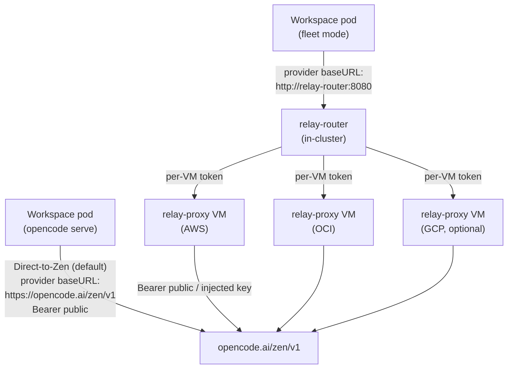

# Inference Relay

This page covers how LLMSafeSpaces reaches free-tier LLM inference (opencode Zen models). The default mode is **direct-to-Zen**: workspace pods call `https://opencode.ai/zen/v1` using opencode's built-in anonymous `public` key — no relay, no configuration. Operators who hit free-tier per-IP rate limits at scale can opt into the **self-hosted multi-cloud fleet** (Epic 42): the `InferenceRelay` CRD, `relay-router`, and `relay-proxy` VMs that rotate IPs across AWS, OCI, and GCP.

The Cloudflare Worker relay (Epic 26) was **removed in [Epic 60](https://github.com/lenaxia/LLMSafeSpaces/blob/main/design/stories/epic-60-remove-cf-worker-relay/README.md)** (2026-07-12) because Zen blocks Cloudflare Worker IPs. It is no longer a deployable option.

## On this page

- [Why a relay exists](#why-a-relay-exists)
- [Two modes](#two-modes)
- [Self-hosted multi-cloud fleet (Epic 42)](#self-hosted-multi-cloud-fleet-epic-42)
- [When to use which](#when-to-use-which)
- [The relay-token auth model](#the-relay-token-auth-model)
- [429 rotation and failover](#429-rotation-and-failover)
- [Cold-start optimization (free-models refresher)](#cold-start-optimization-free-models-refresher)
- [A full InferenceRelay CR example](#a-full-inferencerelay-cr-example)
- [Monitoring the fleet](#monitoring-the-fleet)
- [Cost management](#cost-management)
- [Related](#related)

---

## Why a relay exists

Workspace pods run arbitrary agent code. In the default **direct-to-Zen** mode, pods authenticate to Zen with opencode's built-in anonymous `public` key — that is not a secret, so there is nothing to exfiltrate and no relay is required. This is what the chart ships with.

A relay becomes useful when free-tier per-IP rate limits start biting at scale. The **self-hosted multi-cloud fleet** inserts a proxy layer between the workspace and the upstream so that requests egress from a rotating pool of cloud VM IPs instead of a single cluster egress address. When a VM's IP gets throttled (429 storm), the controller destroys and reprovisions it with a fresh IP.

The fleet forwards requests to the upstream Zen endpoint (`https://opencode.ai/zen/v1` by default) and injects (or forwards) the authorization. Workspace pods see only the in-cluster relay-router URL and a per-workspace bearer token.

---

## Two modes

The two modes are not interchangeable at runtime — they are a **deployment choice**, set once at install time:



- **Direct-to-Zen (default).** Leave the chart as shipped. Workspace pods call `https://opencode.ai/zen/v1` directly using opencode's built-in `public` key. Nothing to configure.
- **Self-hosted multi-cloud fleet (Epic 42).** Opt in with `controller.inferenceRelay.enabled: true`. Workspace pods route through the in-cluster **relay-router**, which distributes traffic across relay VMs and rotates IPs on 429 storms.

!!! note "Cloudflare Worker relay removed"
    The Cloudflare Worker relay (Epic 26) was removed in [Epic 60](https://github.com/lenaxia/LLMSafeSpaces/blob/main/design/stories/epic-60-remove-cf-worker-relay/README.md) on 2026-07-12. Zen now blocks Cloudflare Worker egress IPs, making the Worker path unusable. There is no replacement Worker; use direct-to-Zen or the self-hosted fleet.

> **Not to be confused with the relay config subsystem.** The [relay config subsystem](https://github.com/lenaxia/LLMSafeSpaces/blob/main/README-LLM.md) describes how `agent-config.json` is built *inside* the workspace pod. This page describes the *external* fleet of VMs the pod's relay injector points at (when the fleet is enabled).

---

## Self-hosted multi-cloud fleet (Epic 42)

The self-hosted fleet provisions and health-checks relay VMs across AWS (paid primary), OCI (free secondary), and optionally GCP. Workspace pods route through the in-cluster **relay-router**, which distributes traffic across healthy VMs and falls back to direct upstream when all VMs are down.

### Components

| Component | Location | Role |
|---|---|---|
| `InferenceRelay` CRD | `pkg/apis/llmsafespaces/v1/` | Desired fleet state: providers, health-check, 429-rotation, fallback. Cluster-scoped (`irelay`). |
| Relay reconciler | `controller/internal/relay/` | Provisions VMs via cloud-init, health-checks, destroys + reprovisions on 429 storms. AWS, OCI, GCP drivers. |
| relay-router | `cmd/relay-router/` | In-cluster Deployment (1 replica). Distributes traffic across healthy VMs (weighted), detects 429 storms, falls back to direct upstream. |
| relay-proxy | `cmd/relay-proxy/` | Reverse proxy run *on each relay VM*. Distributed via cloud-init (SHA-256 verified). Token-gated. |
| Admin API | `api/internal/handlers/relay_admin.go` | Setup wizard + status dashboard (`/api/v1/admin/relay/*`). |

### Enabling the fleet

```yaml
controller:
  inferenceRelay:
    enabled: true              # requires rbac.scope=cluster (cluster-scoped CRD)
    routerURL: "http://relay-router:8080"
    workspaceRouterURL: ""     # empty → derived cross-namespace FQDN

    artifact:
      urls:
        - "https://github.com/lenaxia/LLMSafeSpaces/releases/download/v0.1.0-relay"
      sha256Arm64: "671c46c6c3c1b0afabe9fcdf4c815f4c0e08fe2c28d5d6eff988ba20900b2fc8"
      sha256Amd64: "ac12e27bf3a565781749b3bde5d0ff7062e362da259f9702e7852f351b731155"

    upstreamURL: "https://opencode.ai/zen/v1"
    upstreamAuth:
      keySecret:
        name: ""     # optional: real upstream key for router-side injection
        key: "key"
      header: ""     # "" → Authorization (Bearer <key>); set "x-api-key" for Anthropic-native

rbac:
  scope: "cluster"   # required: InferenceRelay is cluster-scoped
```

!!! warning "Feature gate requires cluster RBAC"
    `InferenceRelay` is a cluster-scoped CRD. Enabling `controller.inferenceRelay.enabled` requires `rbac.scope=cluster` so the controller can watch/manage CRs across namespaces. The RBAC rules for `inferencerelays` + `configmaps` are conditionally added to the cluster-scoped ClusterRole when this is enabled.

### Driver configuration

Provider credentials are stored as K8s Secrets via the admin API:

```bash
# Store AWS provider credentials
curl -X POST "$API/api/v1/admin/relay/aws-creds" \
  -H "Authorization: Bearer $ADMIN_TOKEN" \
  -d '{"accessKeyId":"...","secretAccessKey":"...","region":"us-east-1"}'

# Store OCI provider credentials
curl -X POST "$API/api/v1/admin/relay/oci-creds" \
  -H "Authorization: Bearer $ADMIN_TOKEN" \
  -d '{"tenancy":"...","user":"...","fingerprint":"...","key":"...","region":"us-phoenix-1"}'

# Store GCP provider credentials (optional)
curl -X POST "$API/api/v1/admin/relay/gcp-creds" \
  -H "Authorization: Bearer $ADMIN_TOKEN" \
  -d '{"serviceAccountKey":"...","project":"..."}'
```

### Deploying the fleet

```bash
# Check prerequisites
curl "$API/api/v1/admin/relay/setup" -H "Authorization: Bearer $ADMIN_TOKEN"

# Create/reconcile the InferenceRelay CR
curl -X POST "$API/api/v1/admin/relay/deploy" \
  -H "Authorization: Bearer $ADMIN_TOKEN"

# Check fleet health
curl "$API/api/v1/admin/relay/status" -H "Authorization: Bearer $ADMIN_TOKEN"
```

The setup endpoint returns a prerequisite checklist: router deployed, CRD installed, provider creds present.

### Building the VM binaries

The relay-proxy binary is cross-compiled (not containerized):

```bash
make relay-bin
# → deploy/relay-proxy-arm64, deploy/relay-proxy-amd64
```

Publish these to a mirror (GitHub Release asset is the default), then set `artifact.urls` and the SHA-256 values. Cloud-init downloads and verifies the binary before exec.

---

## When to use which

| Criterion | Direct-to-Zen (default) | Self-hosted fleet |
|---|---|---|
| IP rotation | No (single client egress IP) | Yes (AWS + OCI + GCP IPs) |
| Cloud spend | None | AWS paid + OCI free tier + optional GCP |
| Ops complexity | None (chart default) | High (VMs across clouds, router, drivers, CRD) |
| Failover | N/A (direct upstream) | Automatic (weighted router + direct-upstream fallback) |
| Setup | None | Multi-cloud accounts + `rbac.scope=cluster` |
| Scale | Low–medium | Medium–high |
| Best for | Homelab, small team | Multi-tenant SaaS, 429 resilience at scale |

**Default: direct-to-Zen.** It is zero-config and zero-cost. Switch to the self-hosted fleet when free-tier per-IP rate limits start throttling your workspaces at scale and IP rotation matters.

---

## The relay-token auth model

> This section applies only to the **self-hosted fleet**. Direct-to-Zen workspaces authenticate to Zen with the built-in `public` key and do not transit the router↔relay path.

The router↔relay path was originally a WireGuard mesh. **Removed in worklog 0447** and replaced with plaintext HTTP + **per-VM shared-secret tokens** (`X-Relay-Token` header, `crypto/subtle.ConstantTimeCompare`):

- **Per-VM (not fleet-wide) tokens** — preserve WG's tight blast radius. A compromised VM's token cannot be used against sibling relays. Stored in the `relay-vm-tokens` Secret keyed by provider slot; rotation = destroy + reprovision.
- **`/healthz` and `/metrics` on relay-proxy are token-exempt** — the router probes health without the per-VM token.
- **Plaintext HTTP (not TLS)** — accepted trade-off: the path only carries free-tier Zen access, so the worst case is rate-limit exposure, not secret theft. See the supersession banner in the Epic 42 README.

### Router-side upstream key injection (optional)

By default, the router forwards the client's `Authorization: Bearer public` unchanged (free-tier Zen access via the anonymous `public` key). For a paid gateway upstream, configure `upstreamAuth.keySecret`:

```yaml
controller:
  inferenceRelay:
    upstreamAuth:
      keySecret:
        name: relay-upstream-key
        key: key
      header: ""   # "" → Authorization; "x-api-key" for Anthropic-native
```

The injected key transits the router→relay HTTP path (per-VM token auth) and is never persisted on a relay VM disk.

---

## 429 rotation and failover

The router's `SelectRelay` is weighted:

| Provider | Weight | Receives traffic when |
|---|---|---|
| AWS | 1000 | Healthy (primary) |
| OCI | 100 | AWS unavailable or draining |
| GCP | 1 (optional) | Both AWS and OCI unavailable |

When a relay VM returns sustained 429s or becomes unhealthy, the controller destroys and reprovisions it:

```bash
# Rotate a specific VM
curl -X POST "$API/api/v1/admin/relay/rotate/$VM_ID" \
  -H "Authorization: Bearer $ADMIN_TOKEN"
```

### Fallback mode

When all VMs are down, the router falls back to direct upstream access, rate-limited (default 0.5 req/s, max 1 concurrent) to avoid worsening IP throttling. This keeps workspaces functional (degraded) during a full fleet outage.

### Pause/resume reconciliation

```bash
curl -X POST "$API/api/v1/admin/relay/pause" -H "Authorization: Bearer $ADMIN_TOKEN"
# ... investigate ...
curl -X POST "$API/api/v1/admin/relay/resume" -H "Authorization: Bearer $ADMIN_TOKEN"
```

---

## Cold-start optimization (free-models refresher)

The controller periodically fetches the opencode free-tier model catalog from `models.dev` and publishes it as a ConfigMap (`llmsafespaces-free-models`). Workspace pods consume the CM to pre-render their relay `agent-config.json` before opencode boots, eliminating the in-pod opencode-restart cycle (~6–8s saved per cold start and every resume).

```yaml
controller:
  freeModelsRefresher:
    enabled: true               # default
    refreshInterval: 6h          # catalog changes ~weekly; 6h is generous
    apiURL: ""                   # empty → https://models.dev/api.json; override for air-gapped
```

When disabled, workspace pods fall back to the in-pod relay injector goroutine (legacy behavior).

---

## A full InferenceRelay CR example

When you call `POST /api/v1/admin/relay/deploy`, the admin handler creates (or reconciles) an `InferenceRelay` CR. For GitOps-managed deployments, you can apply the CR directly:

```yaml
apiVersion: llmsafespaces.dev/v1
kind: InferenceRelay
metadata:
  name: default
spec:
  upstream:
    url: "https://opencode.ai/zen/v1"
  providers:
    aws:
      enabled: true
      region: "us-east-1"
      instanceType: "t3.micro"
      # Credentials come from the relay-aws-creds Secret (stored via admin API)
    oci:
      enabled: true
      region: "us-phoenix-1"
      shape: "VM.Standard.E2.1.Micro"
      # Free-tier eligible
    gcp:
      enabled: false
  healthCheck:
    interval: 30s
    timeout: 5s
    unhealthyThreshold: 3
  rotation:
    on429Storm: true      # destroy + reprovision on sustained 429s
    maxAge: 720h          # rotate VMs every 30 days
  fallback:
    enabled: true
    rateLimit: 0.5        # req/s when all VMs down
    maxConcurrent: 1
```

The controller reconciles this CR: provisions VMs via cloud-init, health-checks them, and syncs the `relay-router-peers` ConfigMap that the router reads.

---

## Monitoring the fleet

The relay-router exposes Prometheus metrics on `/metrics` (port 8080). The controller scrapes these (configured via `controller.inferenceRelay.routerURL`). Key metrics:

| Metric | Type | Description |
|---|---|---|
| `relay_requests_total` | Counter | Requests by provider, status |
| `relay_429_total` | Counter | Upstream 429s by provider |
| `relay_vm_health` | Gauge | 1=healthy, 0=unhealthy per VM |
| `relay_fallback_total` | Counter | Direct-upstream fallback events |
| `relay_active_vms` | Gauge | Healthy VM count by provider |

### Fleet status via API

```bash
curl "$API/api/v1/admin/relay/status" \
  -H "Authorization: Bearer $ADMIN_TOKEN" | jq
```

Returns per-VM observed state: provider, health, last 429 timestamp, age, and the weighted distribution the router is using.

### Alerting on the fleet

Recommended alerts:

- `relay_active_vms == 0` for >2m → critical (fleet down, fallback active).
- `rate(relay_429_total[5m]) > 10` → warning (upstream throttling; consider rotation).
- `relay_vm_health == 0` for >5m → warning (a VM is unhealthy and awaiting reprovision).

---

## Cost management

The self-hosted fleet's cost is dominated by AWS (the paid primary). OCI free tier and GCP (optional) reduce cost. To control spend:

- Use OCI as the secondary (free-tier eligible shapes).
- Set `rotation.maxAge` to recycle VMs (fresh IPs) without provisioning more.
- Monitor `relay_active_vms` — sustained high VM counts indicate either load or stuck provisioning.
- The router weights AWS at 1000, OCI at 100 — so AWS receives all traffic when healthy. Scale AWS instance count (via the provider config) to match your inference load; OCI is a fallback, not a load-balancer.

Direct-to-Zen is zero-cost (no cloud spend) and is the right default where free-tier per-IP limits are not a concern.

---

## Related

- [Security Hardening](security.md) — the relay-token auth model and supply-chain integrity.
- [Configuration](configuration.md) — direct-to-Zen defaults and fleet opt-in.
- [Helm Values Reference](../reference/helm-values.md) — `controller.inferenceRelay.*`.
