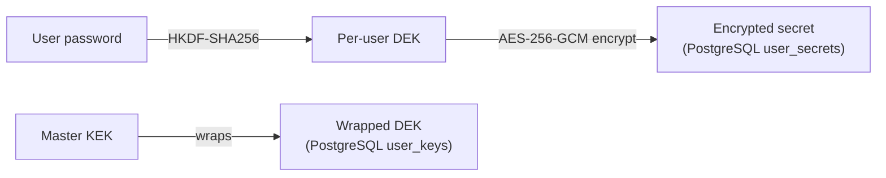

# Security Hardening

This page translates the LLMSafeSpaces threat model into operator-actionable guidance: what the platform protects against by default, what it does not, and which configuration knobs matter. It covers the pod security context, gVisor kernel isolation (and the admin-gated opt-out), the master KEK and its rotation, per-user DEKs, the JWT iss/aud claims, the CORS guard, the terminal Origin check, and the RuntimeClass webhook. For the full gap table (50 tracked items with file:line evidence), see the [Threat Model](../architecture/threat-model.md).

## On this page

- [What the platform protects against](#what-the-platform-protects-against)
- [What it does not protect against](#what-it-does-not-protect-against)
- [Pod security context](#pod-security-context)
- [gVisor kernel isolation](#gvisor-kernel-isolation)
- [The master KEK](#the-master-kek)
- [Per-user DEKs and the encrypted secret store](#per-user-deks-and-the-encrypted-secret-store)
- [JWT hardening](#jwt-hardening)
- [CORS and the terminal Origin check](#cors-and-the-terminal-origin-check)
- [The RuntimeClass webhook](#the-runtimeclass-webhook)
- [Pod Security Admission](#pod-security-admission)
- [Honest limitations](#honest-limitations)

---

## What the platform protects against

| Threat | Control | Status |
|---|---|---|
| Container escape via kernel exploit | gVisor (`runsc`) RuntimeClass (opt-in) | Shipped, opt-in |
| Cross-tenant pod-to-pod network access | Default-deny ingress NetworkPolicy | Shipped, on by default |
| Sandbox reaching kube-apiserver / cloud metadata | Egress NetworkPolicy blocks RFC1918/CGNAT/169.254 | Shipped, on by default |
| Sandbox reading K8s ServiceAccount token | `AutomountServiceAccountToken: false` | Shipped |
| Proxy IDOR (workspace A accessed by user B) | `WorkspaceAccessMiddleware` on all `:id` routes | Fixed (G33) |
| Proxy forwarding client headers to sandbox | Explicit allowlist (`Content-Type`, `Accept`, `X-Request-ID`); hop-by-hop stripped | Fixed (G34) |
| Terminal WebSocket cross-origin hijacking | Same-Origin default + operator allowlist | Fixed (G39) |
| Master KEK in `/proc/1/environ` | File-mount delivery (mode 0440) | Fixed (G48) |
| Plaintext credentials on PVC at rest | tmpfs-backed emptyDir for all credential paths | Shipped |
| Credential file races / non-atomic writes | `pkg/agentd/secrets` typed package, atomic 0600 writes, path-traversal check | Fixed (G2, G20) |
| Default Postgres/Redis passwords | Auto-generated 32-char random on install | Fixed (G26) |
| JWT revocation bypass | Dual-key revocation (`token:<hash>` + `token:<jti>`) | Fixed (G18) |
| Email enumeration via login timing | Dummy bcrypt on all failure paths | Fixed (G27) |
| First-user-admin race | Atomic SQL CTE | Fixed (G8) |

---

## What it does not protect against

These are documented limitations, not bugs. See the [Threat Model](../architecture/threat-model.md) for the full table.

| Gap | Severity | Status | Operator action |
|---|---|---|---|
| **G4** — No mTLS between API and workspace pods | Medium | Accepted | Deploy a service mesh (Linkerd/Istio) if pod-network MITM is in your threat model. |
| **G9** — opencode binary not checksum-verified at build | Medium | Accepted | opencode upstream doesn't publish checksums. gh CLI is now checksum-verified (`checksums.txt`). Pin versions; track upstream CVEs. Release images are cosign-signed. |
| **G30** — External DNS resolvers reachable (DNS exfil) | Medium | Accepted | See [Networking](networking.md#dns-exfiltration). Standard `NetworkPolicy` cannot restrict DNS by domain; use Cilium FQDN or Calico GlobalNetworkPolicy. |
| **G40** — Agentd user port (4097) has no application-layer auth | Medium | Accepted | NetworkPolicy is the trust boundary — only API server pods can reach workspace pods on port 4097. |
---

## Pod security context

Every chart-shipped pod (API, controller, MCP, frontend) and every workspace pod complies with the Kubernetes `restricted` Pod Security profile. The chart applies PSA labels to the namespace at all three levels (enforce, audit, warn):

```yaml
namespace:
  podSecurityEnforce: "restricted"
  podSecurityVersion: "latest"
```

The container security context for workspace pods (and all chart pods):

```yaml
podSecurityContext:
  runAsNonRoot: true
  runAsUser: 65532
  runAsGroup: 65532
  fsGroup: 65532
  seccompProfile:
    type: RuntimeDefault

containerSecurityContext:
  allowPrivilegeEscalation: false
  readOnlyRootFilesystem: true
  runAsNonRoot: true
  runAsUser: 65532
  runAsGroup: 65532
  capabilities:
    drop:
      - ALL
```

Additionally, workspace pods set:

- `AutomountServiceAccountToken: false` (G17) — no SA token in the pod.
- `EnableServiceLinks: false` (G22) — no namespace topology leaked via service env vars.
- `SeccompProfile: RuntimeDefault` at pod level (G24).

Set `namespace.podSecurityEnforce: ""` to opt out of PSA enforcement — not recommended; all chart pods comply with `restricted` anyway, and the label protects against manually-applied non-compliant pods.

---

## gVisor kernel isolation

[gVisor](https://gvisor.dev/) (`runsc`) is the **primary control against kernel-exploitation container escape** for multi-tenant deployments where tenants run arbitrary code. Without gVisor, a kernel CVE in a tenant pod can reach the host node and access other tenants' data. Standard seccomp + cap-drop mitigate but do not eliminate this — they reduce the syscall surface, they do not proxy syscalls in userspace.

### Enabling gVisor

Prerequisites (operator must provision out-of-band):

- gVisor (`runsc`) installed on all workspace nodes.
- Container runtime configured with the `runsc` handler.
- For EKS + Karpenter: install `runsc` via `EC2NodeClass` `userData`.
- For manual clusters: follow [gvisor.dev/install](https://gvisor.dev/docs/user_guide/install/).

Then enable in the chart:

```yaml
gvisor:
  enabled: true
  defaultRuntimeClass: "gvisor"   # change if you have a custom class
```

This creates a `RuntimeClass` named `gvisor` (handler: `runsc`) and sets `--default-runtime-class=gvisor` on the controller. Workspace pods then run under gVisor by default.

### Admin-gated opt-out

Some workloads are gVisor-incompatible (e.g. `ptrace` debuggers). Individual workspaces can opt out via `spec.runtimeClass: "runc"`, but this is **admin-gated**: the workspace validating webhook rejects `spec.runtimeClass` (to any value, including the empty-string opt-out) unless the workspace object carries:

```yaml
metadata:
  annotations:
    llmsafespaces.dev/allow-runtime-class-override: "true"
```

Operators apply that annotation via direct `kubectl` / cluster-admin RBAC. Tenant API users (without cluster RBAC) cannot. This keeps the gVisor default enforced for tenants while allowing operator exceptions.

---

## The master KEK

The master KEK (Key Encryption Key) is the root of trust for at-rest encryption. It wraps API-key DEKs, org SSO client secrets, and every admin/org LLM provider credential. **Compromise of the KEK decrypts every row it wraps.**

### Delivery

The default (and only recommended for production) delivery is a **read-only file mount**:

```yaml
masterSecret:
  deliveryMethod: file
  fileMountPath: /var/run/secrets/llmsafespaces/master-secret
```

The KEK is projected as a file (mode `0440`), read via `LLMSAFESPACES_MASTER_SECRET_FILE`. This eliminates `/proc/1/environ` exposure (G48, fixed). The file loader fails closed on a mis-mounted or short active file.

The legacy env-var path (`deliveryMethod: env`, `LLMSAFESPACES_MASTER_SECRET`) is a deprecated opt-in for non-Helm deploys and logs a startup warning. Do not use it in production.

### Cloud KMS (optional)

For deployments that need exfiltration limitation + audit, the KEK can be backed by cloud KMS instead of the local static file:

```yaml
kms:
  aws:
    enabled: true
    region: "us-east-1"
    credentialsSecret: "aws-kms-creds"
    keyArns:
      providerCredentials: "arn:aws:kms:..."
      orgCredentials: "arn:aws:kms:..."
      masterKek: "arn:aws:kms:..."
```

Three KMS keys are required (per-purpose domain separation). The KEK never leaves the cloud service — an API-pod RCE can call `Decrypt` while running but cannot exfiltrate the key for offline use after eviction. The master-secret file mount is **retained** under KMS to protect the Redis DEK cache (volatile, regenerable). Sustained KMS unavailability causes all KEK-dependent decrypts to fail simultaneously — use multi-region KMS keys for HA.

### Rotation via `rotate-kek`

The `rotate-kek` CLI (`cmd/rotate-kek/main.go`) supports zero-downtime KEK rotation:

- Loads old + new master keys.
- Per-purpose key derivation.
- Re-wraps encrypted rows in Postgres + flushes Redis DEK cache.
- Supports dry-run, resume-from, and multi-table rotation.

See the [Runbook](runbook.md#rotating-the-master-kek) for the full procedure.

### Domain separation (US-50.7)

The `api_keys` provider derives from purpose `"master-kek"` rather than reusing the Redis DEK-cache key (`"dek-cache"`). This narrows blast radius: a Redis compromise cannot help unwrap Postgres `api_keys` DEKs.

---

## Per-user DEKs and the encrypted secret store

User secrets (LLM keys, SSH keys, env secrets) are encrypted with a **per-user DEK** (AES-256-GCM), derived from the user's password via HKDF-SHA256. The platform never stores plaintext.



Consequences:

- User secrets are encrypted at rest with per-user DEKs. The platform cannot decrypt them without the user's password.
- A password change re-wraps the DEK and **revokes all outstanding sessions** (G38 fixed — every JWT, including the caller's, is invalidated via `RevokeAllUserSessions`).
- Auto-provisioned SSO users have a random unusable bcrypt hash, so they have no password to derive a DEK from. Personal credential operations stay unavailable until they set a password; org workspaces still work via server-side injection.

### Workspace credentials

Workspace credentials (the opencode basic-auth password, bound secrets) are stored exclusively as **Kubernetes Secrets** — never in PostgreSQL, Redis, or logs. They are materialized into the workspace pod via init containers onto tmpfs (`/sandbox-cfg`, `/sandbox-runtime`), which is wiped on pod death.

---

## JWT hardening

| Control | Implementation |
|---|---|
| Signing algorithm | HMAC-SHA256 only; alg-confusion check enforces `SigningMethodHMAC` |
| `iss` / `aud` claims | Minted on every JWT, validated on every parse. Default `llmsafespaces`; set distinct values for multi-instance deployments |
| `jti` claim | Per-token revocation (not per-user) |
| Revocation | Dual-key: `token:<hash>` + `token:<jti>` (G18) |
| Cache key hashing | JWT cache keys MD5-hashed before Redis storage (no raw JWT in Redis) |
| Token extraction | Header-only by default; query param and cookie extraction disabled |
| Rotation | Restart-with-new-secret only (no rotation primitives in code — gap A8) |

### Setting iss/aud

```yaml
api:
  config:
    auth:
      jwtIssuer: "llmsafespaces-prod-use1"
      jwtAudience: "llmsafespaces-prod-use1"
```

Set these when running multiple instances that should not accept each other's tokens.

### Rotating the JWT secret

The JWT signing secret has no in-process rotation primitive. Rotation requires changing the secret and restarting the API pods, which invalidates all active sessions. See the [Runbook](runbook.md#rotating-the-jwt-secret).

---

## CORS and the terminal Origin check

### CORS guard

The API enforces a restrictive CORS policy. The fail-closed guard in `config.validateSecurity` refuses to start if `allowedOrigins=["*"]` is combined with `allowCredentials=true` (Fetch §3.2.1 violation):

```yaml
api:
  config:
    security:
      allowedOrigins:
        - "https://app.example.com"
      allowCredentials: false
```

When credentials are needed (cross-origin frontend), list each origin explicitly — wildcards are rejected.

### Terminal WebSocket Origin check

The WebSocket terminal proxy (`POST /workspaces/:id/terminal/ticket` → `GET /workspaces/:id/terminal`) enforces an Origin policy on upgrade (G39, fixed):

- **Same-origin by default** — a browser request whose `Origin` does not match the API's own Host is rejected at upgrade.
- **Non-browser clients** (no `Origin` header) are accepted — they authenticate via the single-use ticket, not cookies, so CSRF does not apply.
- **Operator allowlist** — additional origins accepted via `terminal.allowedOrigins`:

```yaml
terminal:
  allowedOrigins:
    - "https://app.example.com"
```

A single entry of `"*"` disables Origin checking entirely (the historical behavior) — use only if you understand the cross-site WebSocket hijacking risk.

---

## The RuntimeClass webhook

The workspace validating webhook enforces the gVisor opt-out gate (see [gVisor](#gvisor-kernel-isolation)). It rejects any `spec.runtimeClass` value unless the workspace carries the `llmsafespaces.dev/allow-runtime-class-override: "true"` annotation. This is a cluster-admin-only escape hatch.

The webhook also enforces:

- **Storage caps** — `maxWorkspaceStorageGi` (default 1024), `allowedStorageClassNames`.
- **Resource caps** — `maxWorkspaceCPUMillicores` (16000), `maxWorkspaceMemoryMi` (65536).
- **Registry allow-list** — `allowedImageRegistries` for `spec.runtime` values shaped like image references.

```yaml
webhooks:
  allowedImageRegistries:
    - "ghcr.io/lenaxia/"
  allowedStorageClassNames: []
  maxWorkspaceStorageGi: 1024
  maxWorkspaceCPUMillicores: 16000
  maxWorkspaceMemoryMi: 65536
```

Set `webhooks.failurePolicy: "Fail"` (the default) so admission rejects requests if the webhook is unavailable. Set `"Ignore"` for availability over security.

---

## Pod Security Admission

The chart applies Pod Security Admission labels to the release namespace at all three levels:

```yaml
namespace:
  podSecurityEnforce: "restricted"
  podSecurityVersion: "latest"
```

This enforces the `restricted` profile (G11). All chart-shipped pods comply. Workspace pods comply by construction (the controller generates the spec). Set `podSecurityEnforce: ""` to opt out — only if you have an equivalent control (Kyverno, OPA Gatekeeper).

### Kyverno (deferred)

Kyverno admission policy templates are deferred to V2.1 per EVOLUTION-V2.md §9.6. The chart has a `kyverno.enabled` toggle (default `false`) that currently only prints a warning in `NOTES.txt`. When shipped, Kyverno policies will validate pod specs as defense-in-depth even if the controller has a bug.

---

## Honest limitations

LLMSafeSpaces is **v0.3.x**. Not everything is perfect. The most operationally relevant limitations:

1. **No mTLS on the pod network (G4 accepted).** API↔workspace traffic is plain HTTP. Use a service mesh if this is in your threat model.
2. **KEK lives in API process memory.** A process-level attacker calls `Decrypt` exactly as the application does. KMS limits exfiltration + adds audit; it does not prevent in-process abuse.
3. **opencode binary not checksum-verified (G9 accepted).** Pin versions; the upstream does not publish checksums. gh CLI is checksum-verified. Release images are cosign-signed so the image as a whole has provenance, but the opencode binary inside is not individually verified.
4. **No in-process JWT rotation (A8).** Rotating the JWT secret invalidates all sessions and requires a restart.
5. **DNS exfiltration not blocked (G30 accepted).** See [Networking](networking.md#dns-exfiltration).

**Do not deploy this as a public multi-tenant SaaS** without reviewing the [Threat Model](../architecture/threat-model.md) and the remaining open gaps. It is suitable for homelab and small-team deployments with the threat model understood.

---

## Related

- [Threat Model](../architecture/threat-model.md) — the full 50-item gap table with file:line evidence.
---

## Supply chain security

### Image signing

All release images (`ghcr.io/lenaxia/llmsafespaces/*`) are signed with [cosign](https://github.com/sigstore/cosign) keyless signing via GitHub Actions OIDC. Signatures are recorded in the public [Rekor](https://github.com/sigstore/rekor) transparency log.

**Verify an image before deploying:**

```bash
cosign verify ghcr.io/lenaxia/llmsafespaces/api:0.3.0 \
  --certificate-identity-regexp "https://github.com/lenaxia/LLMSafeSpaces" \
  --certificate-oidc-issuer "https://token.actions.githubusercontent.com"
```

If the command succeeds, the image was built by the project's release workflow. If it fails, the image may be tampered or from an untrusted source.

### Image scanning

The release pipeline scans every built image with [Trivy](https://github.com/aquasecurity/trivy) for HIGH/CRITICAL CVEs. The scan runs on the actual OCI images (not just source files), catching vulnerabilities in base images, system packages, and application dependencies. If any HIGH/CRITICAL CVE is found, the release fails.

The filesystem scan in `security-scan.yml` runs on every PR and covers source files (`go.mod`, `package-lock.json`, etc.) — this is complementary, not redundant.

### SBOM

Each release includes a Software Bill of Materials (SBOM) in CycloneDX JSON format for every image. Download from the GitHub Release page and feed into [Dependency-Track](https://dependencytrack.org/), [grype](https://github.com/anchore/grype), or your preferred SBOM consumer.

### Base image pinning

Dockerfile `FROM` lines use tag references (e.g. `golang:1.25`, `debian:bookworm-slim`) rather than digest-pinning. [Renovate](https://docs.renovatebot.com/) is configured with `docker:pinDigests` to open PRs that pin each base image to its current digest. Accept those PRs to lock the supply chain further.

### What's not yet covered

- **No admission-time image verification policy.** The cluster does not enforce cosign verification at deploy time. Operators who want this should install [cosign policy controller](https://github.com/sigstore/policy-controller) or [Kyverno](https://kyverno.io/) with a verifyImages rule.
- **Base runtime image ships a full toolchain.** The `base` runtime image (`debian:bookworm-slim`) includes bash, build-essential, git, curl, apt, database clients. This is a feature for a development sandbox but means a compromised agent has a lot of tooling. A future distroless runtime variant is tracked as a follow-up.

---

## See also

- [Networking](networking.md) — the NetworkPolicies this page references.
- [Multi-tenant Isolation](multi-tenant.md) — tenant identity and per-tenant quotas.
- [Runbook](runbook.md) — KEK rotation, JWT secret rotation, compromised-pod response.
