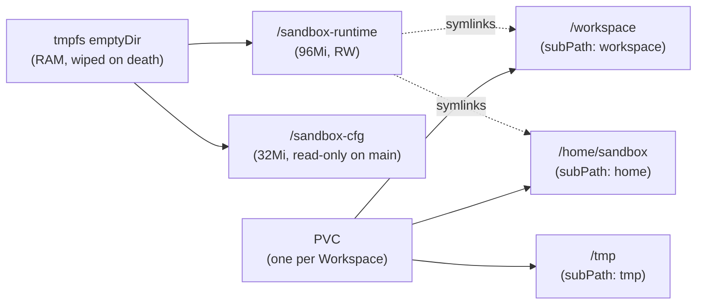

# Storage

This page covers how LLMSafeSpaces uses storage: the PVC layout mounted into every workspace pod, how to select and size a StorageClass, the tmpfs-backed emptyDir volumes used for credentials and runtime config, and why the chart deliberately does not set `ephemeral-storage` limits on workspace pods.

## On this page

- [Volume layout at a glance](#volume-layout-at-a-glance)
- [PVC-backed mounts](#pvc-backed-mounts)
- [tmpfs emptyDir mounts](#tmpfs-emptydir-mounts)
- [StorageClass selection](#storageclass-selection)
- [Sizing](#sizing)
- [Backup and recovery](#backup-and-recovery)
- [The storage-settings trace](#the-storage-settings-trace)
- [Why ephemeral-storage limits are not set](#why-ephemeral-storage-limits-are-not-set)
- [cgroup v2 requirement](#cgroup-v2-requirement)

---

## Volume layout at a glance

Every workspace pod has five volume mounts. Three are PVC-backed (persist across suspend/resume), two are tmpfs-backed emptyDir (wiped on pod death). This split is deliberate: it keeps plaintext credentials off the PVC at rest while keeping user data and caches durable.

| Mount | Type | Persists? | Purpose |
|---|---|---|---|
| `/workspace` | PVC (`subPath: workspace`) | **Yes** | User workspace data, `opencode.db`, `auth.json` (symlink) |
| `/home/sandbox` | PVC (`subPath: home`) | **Yes** | SSH keys (symlink target), secrets base dir, enricher cache, tool caches |
| `/tmp` | PVC (`subPath: tmp`) | **Yes** | init scripts, package caches |
| `/sandbox-cfg` | emptyDir (`Medium: Memory`, 32Mi) | No | `secrets.json`, `workspace-config.json`, bootstrap password |
| `/sandbox-runtime` | emptyDir (`Medium: Memory`, 96Mi, RW) | No | `agent-config.json`, `secrets-env`, `admin-prompt.md`, reload-replay cache, symlink targets |



---

## PVC-backed mounts

A single PVC is created per Workspace CRD. The three PVC-backed paths are `subPath` mounts into that one PVC, so they share the PVC's capacity and StorageClass but are isolated directory-wise.

### `/workspace`

The primary user filesystem. Contains:

- Project files (the agent's working directory).
- `opencode.db` — opencode's session/message database.
- `/workspace/.local/opencode/` — opencode state. `XDG_DATA_HOME=/workspace/.local` is set so this path is a symlink to tmpfs at runtime (see below).

Because `/workspace` is PVC-backed, **agent session history survives suspend/resume**. Suspending a workspace deletes the pod but retains the PVC; activating re-creates the pod, which reattaches to the existing PVC.

### `/home/sandbox`

Persistent home-directory content that should survive restarts:

- `.ssh/` — SSH keys (these are symlink targets pointing into `/sandbox-runtime/rt/*`, created by the init container).
- Secrets base directory.
- Enricher cache, tool caches (mise, npm, pip, etc.).

### `/tmp`

Used for init scripts and package caches. Note: `agent-config.json` and `secrets-env` were **moved off `/tmp`** to `/sandbox-runtime` (tmpfs) — both for at-rest data isolation and because the `credential-setup` init container's `/tmp` is read-only (`ReadOnlyRootFilesystem` with no writable emptyDir mounted).

---

## tmpfs emptyDir mounts

The two tmpfs-backed emptyDir volumes are the security-critical part of the layout. They hold plaintext credentials at runtime but are **wiped on pod death** — the PVC retains only dangling symlinks, no plaintext bytes.

### `/sandbox-cfg` (32Mi, read-only on main container)

Written by init containers, read-only in the main container. Contains:

- `secrets.json` — the base credential set (server-KEK credentials).
- `workspace-config.json` — workspace configuration (default model, etc.).
- `password` — the opencode basic-auth password for this workspace (from bootstrap).

### `/sandbox-runtime` (96Mi, read-write)

The runtime working area. Contains:

- `agent-config.json` — the file opencode reads for provider credentials. Written atomically by `AgentConfigWriter.Rebuild()` (temp-file + `os.Rename`).
- `secrets-env` — environment variables for env-secret-type credentials.
- `admin-prompt.md` — the merged platform→org→role→user system prompt.
- `last-reload-secrets.json` — the reload-replay cache that restores user-DEK credentials after a container restart (OOM, panic, kubelet restart).
- `rt/*` — symlink targets for `$HOME`-relative credential paths (`.ssh`, `.secrets`, `.git-credentials`, `auth.json`).

The symlink architecture is key: `$HOME`-relative credential paths are symlinks created by the init container pointing into `/sandbox-runtime/rt/*`. On pod death, tmpfs is wiped and the PVC retains only dangling symlinks.

??? info "The reload-replay cache"
    `last-reload-secrets.json` is what lets user-DEK credentials (env-secrets like `GH_TOKEN`, SSH keys, user LLM providers) survive a main-container restart. Without it, the next boot's `reset()` would wipe them and the base `secrets.json` (bootstrap, sessionless) never contained them. The cache is written after `Materialize` succeeds, is never written on a hard failure (500), and degrades to base-only on a corrupt read.

---

## StorageClass selection

### How the StorageClass is chosen

The StorageClass for a workspace PVC is resolved in this order:

1. **Workspace request** — if the create-workspace API call includes `storageClass`, that wins (subject to the webhook allow-list, see below).
2. **`workspace.defaultStorageClass` setting** — the instance setting (Tier 1 if pinned via Helm, Tier 2 if admin-mutable).
3. **Cluster default StorageClass** — Kubernetes falls back to the StorageClass annotated `is-default-class`.

### Pinning the default via Helm

```yaml
workspace:
  defaultStorageClass: longhorn-2r
```

When non-empty, this promotes `workspace.defaultStorageClass` to Tier 1 (read-only in the admin UI). When empty (the default), the setting stays admin-mutable. See [Configuration](configuration.md#helm-overrides-for-settings).

### Restricting allowed StorageClasses

The validating webhook can constrain which StorageClass names a workspace may request:

```yaml
webhooks:
  allowedStorageClassNames: []   # empty = any allowed
```

When non-empty, `spec.storage.storageClassName` must be one of these names. This is defense-in-depth for clusters where users have direct `kubectl` access.

### Longhorn vs cloud-provider CSI

| StorageClass | Best for | Considerations |
|---|---|---|
| **Longhorn** (2-replica) | Homelab, single-cluster, cost-sensitive | Lower durability than cloud CSI; 2-replica is the minimum for non-data-loss on single-node failure. Set `workspace.defaultStorageClass` to your Longhorn class. |
| **Cloud CSI** (EBS, PD, Azure Disk) | Production, durability-critical | Higher durability, snapshots, often faster. RWO (single-node-attach) is correct — workspaces are one-pod-per-PVC. |
| **Cloud file CSI** (EFS, Filestore, Azure Files) | Shared access, cross-AZ attach | RWX works but is more expensive and slower for single-pod workloads. Use only if you have a specific reason. |
| **Local PV** | Performance-critical, ephemeral | No replication — node failure loses the PVC. Use only for throwaway workspaces with explicit user expectation. |

!!! tip "Mount options"
    The `/workspace` PVC mount lacks `nosuid`/`nodev` mount options (gap G23, accepted risk). If your StorageClass supports `mountOptions`, add `nosuid,nodev` there for defense-in-depth. This is mitigated at the pod level by `runAsNonRoot` + `NoNewPrivs` + cap-drop `ALL`.

```yaml
# Example: Longhorn StorageClass with hardening mount options
apiVersion: storage.k8s.io/v1
kind: StorageClass
metadata:
  name: longhorn-2r
provisioner: driver.longhorn.io
parameters:
  numberOfReplicas: "2"
  staleReplicaTimeout: "30"
reclaimPolicy: Retain
mountOptions:
  - nosuid
  - nodev
```

---

## Sizing

### Default size

The default workspace storage size is the `workspace.defaultStorageSize` instance setting (schema default `15Gi`). Operators can change it at runtime via the admin settings API; it affects only **new** workspaces.

```bash
curl -X PUT "$API/api/v1/admin/settings/workspace.defaultStorageSize" \
  -H "Authorization: Bearer $ADMIN_TOKEN" \
  -H "Content-Type: application/json" \
  -d '{"value":"20Gi"}'
```

### Hard ceiling

The maximum requested workspace storage is capped at the admission layer by `webhooks.maxWorkspaceStorageGi` (default `1024 Gi`). This applies to all paths including direct `kubectl apply`. Storage requests above this are rejected at admission. The CRD pattern (`^[0-9]+(Gi|Mi)$`) already enforces the shape; this enforces the magnitude.

```yaml
webhooks:
  maxWorkspaceStorageGi: 1024
```

!!! note "PVCs are never resized"
    A PVC's size is set once at creation. Changing `defaultStorageSize` does not affect existing PVCs. Online PVC expansion is not implemented in the controller; if you need to grow a workspace, create a new one and migrate.

### Resource caps

The webhook also caps CPU and memory requests so a workspace can't request absurd resources and stay `Pending` forever:

```yaml
webhooks:
  maxWorkspaceCPUMillicores: 16000   # 16 cores
  maxWorkspaceMemoryMi: 65536        # 64 GiB
```

Set `0` to disable each cap individually.

### Sizing worksheet

When planning capacity for N tenants with the default quotas:

| Resource | Per workspace | Per tenant (15 ws) | 10 tenants |
|---|---|---|---|
| Storage (PVC) | 15 GiB (default) | 225 GiB | 2.2 TiB |
| CPU request | ~500m (typical) | 7.5 cores | 75 cores |
| Memory request | ~1 GiB (typical) | 15 GiB | 150 GiB |

These are aggregate ceilings; actual usage depends on workload. Monitor `workspace_memory_bytes` and PVC usage to right-size.

---

## Backup and recovery

Workspace PVCs hold user data and session history. Treat them as durable state that needs backup.

### Snapshot strategies

| StorageClass | Snapshot support | How |
|---|---|---|
| Longhorn | Yes (built-in) | Longhorn recurring snapshots; disaster-recovery volumes for cross-cluster. |
| EBS CSI | Yes | `VolumeSnapshotClass` + `VolumeSnapshot` resources; AWS Backup for cross-region. |
| PD CSI (GCE) | Yes | `VolumeSnapshotClass` + `VolumeSnapshot`; PD snapshots. |
| Azure Disk CSI | Yes | `VolumeSnapshotClass` + `VolumeSnapshot`. |
| Local PV | **No** | No snapshots — node failure loses the PVC. Use only for throwaway workspaces. |

### Enabling snapshots (example: Longhorn)

```yaml
# Ensure a VolumeSnapshotClass exists
apiVersion: snapshot.storage.k8s.io/v1
kind: VolumeSnapshotClass
metadata:
  name: longhorn
driver: driver.longhorn.io
deletionPolicy: Retain
```

Longhorn recurring snapshots are configured at the Longhorn level (UI or `recurringjob.longhorn.io` CRs), not per-PVC.

### Recovery

See the [Runbook](runbook.md#recovering-from-a-corrupted-pvc) for the PVC restore-from-snapshot procedure.

---

## The storage-settings trace

This is the full path a `storageSize` value takes from API request to PVC:

1. **Frontend** (`frontend/src/api/workspaces.ts`): `storageSize` is intentionally omitted from the create-workspace payload — the API resolves the default.
2. **API service** (`api/internal/services/workspace/workspace_service.go`): on `CreateWorkspace`, if `req.StorageSize` is empty, `instanceSettings.GetString(ctx, "workspace.defaultStorageSize")` supplies it.
3. The resolved size is written into `WorkspaceSpec.Storage.Size` in the CRD, persisted to the `workspace_metadata` PostgreSQL table, and returned in API responses as `storageSize`.

**Side effects of changing `defaultStorageSize`:**

- Affects only **new** workspaces. Existing PVCs are never resized.
- Takes effect immediately on the next workspace creation — no redeploy needed.
- The hard ceiling is `webhooks.maxWorkspaceStorageGi` (default `1024 Gi`), enforced at the Kubernetes admission layer for all paths including direct `kubectl apply`.

### Removed settings

- `workspace.maxStorageSize` — removed. PVC size is set once at creation; the webhook ceiling is the correct infrastructure-level control.
- `workspace.defaultResources.ephemeralStorage` — removed alongside the entire ephemeral-storage concept (see below).

---

## Why ephemeral-storage limits are not set

The pod builder does **not** set `ephemeral-storage` requests or limits on workspace containers. The `Workspace` CRD has no `spec.resources.ephemeralStorage` field, the webhook has no corresponding cap, and Helm has no `maxWorkspaceEphemeralStorageGi` flag. All of these were removed because they protected against a threat the architecture already mitigates.

### What writes to node-local ephemeral storage on a workspace pod

| Source | Counts toward ephemeral storage? | Notes |
|---|---|---|
| Container writable layer (overlay FS) | **No** | `readOnlyRootFilesystem: true` — `EROFS` for all unmounted paths. |
| Container log files (stdout/stderr) | **Yes** | Kubelet writes to `/var/log/pods/` on node disk; kubelet rotation caps at ~50 Mi (10 Mi × 5 files) regardless of pod limits. |
| `/tmp` (PVC `subPath: tmp`) | **No** | PVC-backed. |
| `/workspace` (PVC `subPath: workspace`) | **No** | PVC-backed. |
| `/home/sandbox` (PVC `subPath: home`) | **No** | PVC-backed. |
| `/sandbox-cfg` (emptyDir, `Medium: Memory`) | **No** | Counts toward memory, not ephemeral storage. |

Container logs are the only consumer, and kubelet's own log rotation already bounds them. A per-pod ephemeral-storage limit added no protection beyond that.

!!! warning "When ephemeral limits should come back"
    If a future feature introduces a node-disk-backed `emptyDir` (`Medium: ""`), per-pod ephemeral limits would need to come back, scoped to the actual concern. The current tmpfs-backed emptyDirs count toward memory, not ephemeral storage.

---

## cgroup v2 requirement

The workspace-agentd sidecar reads memory usage and pressure from cgroup v2 (`/sys/fs/cgroup/memory.current`, `/sys/fs/cgroup/memory.max`). cgroup v2 is a **hard requirement** for:

- Memory-pressure warnings (>85% of limit).
- The `workspace_memory_bytes` ops gauge.
- OOM-limit detection / `workspace_oom_kills_total` attribution.

On cgroup v1 hosts these features silently produce nothing — agentd logs a single `Warn` per pod boot ("cgroup v2 memory.current unreadable") so the silent degradation is observable, but the features remain unavailable until the pod is scheduled on a cgroup v2 node.

The chart does **not** set a `nodeSelector` for cgroup v2 because scheduling-time detection is unreliable across distros. The runtime-time warning is the authoritative signal. cgroup v2 is the default on all supported runtime images (Debian bookworm-slim) and all modern Kubernetes node OSes.

---

## Related

- [Configuration](configuration.md) — the storage-settings system and tiered precedence.
- [Security Hardening](security.md) — why credentials live on tmpfs, not the PVC.
- [Helm Values Reference](../reference/helm-values.md) — `workspace.*`, `webhooks.maxWorkspaceStorageGi`.
- [Troubleshooting](troubleshooting.md#pvc-stuck-mounting) — diagnosing PVC mount failures.
