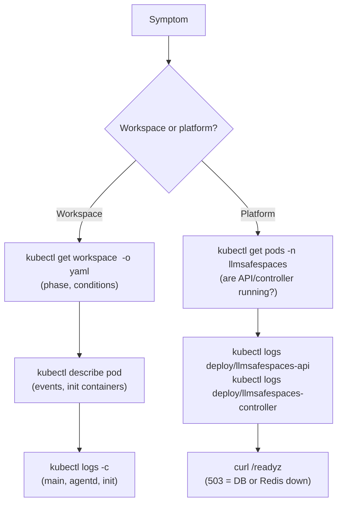

# Troubleshooting

This page covers common failure modes organized by symptom: workspace stuck in `Creating`, `CrashLoopBackOff`, `401` from the proxy, OOM kills, PVC stuck mounting, and `readyz` returning `503`. For each symptom, it gives the likely causes, the diagnostic commands, and where to look (logs, events, CRD status conditions). For routine operational procedures, see the [Runbook](runbook.md).

## On this page

- [General diagnostic approach](#general-diagnostic-approach)
- [Workspace stuck in Creating](#workspace-stuck-in-creating)
- [CrashLoopBackOff](#crashloopbackoff)
- [401 from the proxy](#401-from-the-proxy)
- [OOM kills](#oom-kills)
- [PVC stuck mounting](#pvc-stuck-mounting)
- [readyz returning 503](#readyz-returning-503)
- [Workspace stuck in Suspending/Suspended](#workspace-stuck-in-suspendingsuspended)
- [Webhook rejects workspace creation](#webhook-rejects-workspace-creation)
- [SSE connections drop](#sse-connections-drop)
- [Relay injection never completes](#relay-injection-never-completes)

---

## General diagnostic approach

When something is wrong, check these in order:



### Key commands

```bash
# Workspace status + conditions
kubectl get workspace <id> -o yaml | grep -A20 conditions

# Pod events (scheduling, pulling, init failures)
kubectl describe pod <pod-name>

# Logs by container
kubectl logs <pod-name> -c main          # opencode
kubectl logs <pod-name> -c agentd        # sidecar
kubectl logs <pod-name> -c credential-setup   # init
kubectl logs <pod-name> --all-containers --init-containers

# Controller logs (reconcile loop)
kubectl logs deploy/llmsafespaces-controller -n llmsafespaces

# API logs (proxy, auth, settings)
kubectl logs deploy/llmsafespaces-api -n llmsafespaces

# Health
kubectl -n llmsafespaces port-forward svc/llmsafespaces-api 8080:8080 &
curl http://localhost:8080/readyz
```

---

## Workspace stuck in Creating

The workspace pod isn't reaching `Active` within the expected time (~22s post-optimization for PVC re-attach + opencode boot).

### Likely causes

| Cause | How to check |
|---|---|
| PVC not bound / pending | `kubectl get pvc -l llmsafespaces.dev/workspace` |
| Pod unschedulable (no node fits) | `kubectl describe pod <pod>` → Events |
| Init container failing | `kubectl logs <pod> -c credential-setup --all-containers` |
| Image pull failure | `kubectl describe pod <pod>` → Events |
| Webhook blocked pod creation | `kubectl get events --field-selector reason=FailedAdmission` |
| NetworkPolicy blocking controller health poll | Controller logs: "health probe timeout, 3-strike" → pod killed in a loop |

### Controller health-poll loop

If the controller can't reach the agentd admin port (4098) for health polling, the 3-strike threshold trips, the controller kills the pod, recreates it, and the cycle repeats. Check the controller logs for repeated health-probe timeouts. The fix is ensuring the NetworkPolicy allows controller ingress on 4098 (`networkPolicy.controllerPodLabelSelector`).

### Diagnose

```bash
WS=<workspace-id>
kubectl get workspace "$WS" -o yaml | grep -A20 conditions
kubectl get pods -l llmsafespaces.dev/workspace="$WS"
POD=$(kubectl get pods -l llmsafespaces.dev/workspace="$WS" -o jsonpath='{.items[0].metadata.name}')
kubectl describe pod "$POD"
kubectl logs "$POD" --all-containers --init-containers
```

---

## CrashLoopBackOff

The pod starts then crashes repeatedly.

### Likely causes

| Cause | How to check |
|---|---|
| opencode fails to boot | `kubectl logs <pod> -c main` |
| agentd crashes | `kubectl logs <pod> -c agentd` |
| Credential materialization fails | `kubectl logs <pod> -c credential-setup` (init) |
| Missing secret binding | `kubectl get workspace <id> -o yaml` → `credentialState` |
| Runtime image missing entrypoint | `kubectl logs <pod> -c main` (exec format, no such file) |
| Resource limit too low | `kubectl describe pod <pod>` → last state (OOMKilled) |

### Common: opencode boot failure

opencode reads `agent-config.json` at startup (no hot-reload). If the file is malformed or a provider config is wrong, opencode exits. Check:

```bash
kubectl logs "$POD" -c main
kubectl logs "$POD" -c agentd   # the AgentConfigWriter writes the file
```

### Common: credential-setup init failure

The init container writes credentials to `/sandbox-cfg`. If the bound Secret is missing or the materializer fails (path-traversal check, atomic write failure), the init exits non-zero and the pod never reaches main.

```bash
kubectl logs "$POD" -c credential-setup
kubectl get workspace <id> -o yaml | grep -A5 credentialState
```

---

## 401 from the proxy

The API proxy returns 401 when forwarding to the workspace pod.

### Likely causes

| Cause | How to check |
|---|---|
| Workspace password Secret missing/rotated | `kubectl get secret workspace-pw-<id>` |
| Pod IP refreshed but API cache stale | Restart the API pod; check `wsstate.SetCachedPassword` |
| opencode basic-auth misconfigured | `kubectl logs <pod> -c agentd` for password load |

### The password cache

The API caches per-workspace opencode passwords in Redis (plaintext, 1h TTL). If the pod restarted and got a new password but the cache still holds the old one, the proxy sends stale basic-auth and opencode returns 401. The cache TTL bounds this to 1 hour; a manual fix is to restart the API pod or call `/reload-secrets`.

### Diagnose

```bash
kubectl logs deploy/llmsafespaces-api | grep "401\|proxy\|basic"
kubectl get secret workspace-pw-<id> -o yaml
```

---

## OOM kills

The workspace pod is OOM-killed.

### Likely causes

| Cause | How to check |
|---|---|
| Workspace memory request too low | `kubectl describe pod <pod>` → last state: `OOMKilled` |
| Agent process memory leak | `workspace_memory_bytes` metric trending up |
| Large context window | `workspace_context_tokens` metric high |
| cgroup v1 host (no memory metrics) | agentd logs: "cgroup v2 memory.current unreadable" |

### Attribution

On cgroup v2 hosts, the `workspace_oom_kills_total` metric attributes OOMs to specific workspaces. On cgroup v1, this metric is unavailable (agentd logs a single Warn per pod boot).

### Fix

Increase the workspace memory request (up to `webhooks.maxWorkspaceMemoryMi`, default 64 GiB). This is set at workspace creation; existing workspaces need to be recreated or the pod spec edited (not supported via the API — operator `kubectl` edit).

```bash
kubectl get workspace <id> -o jsonpath='{.spec.resources}' 
```

---

## PVC stuck mounting

The pod is stuck in `ContainerCreating` with a `MountVolume.SetUp` error.

### Likely causes

| Cause | How to check |
|---|---|
| PVC pending (no StorageClass / no capacity) | `kubectl get pvc` → STATUS column |
| RWO PVC already attached elsewhere | `kubectl describe pod <pod>` → Events: "Multi-Attach error" |
| StorageClass misconfigured | `kubectl get sc` |
| Node lost (PVC stranded) | `kubectl get pv` → claim ref to a dead node |

### Multi-Attach error (RWO)

Workspaces use RWO (single-node-attach) PVCs. If a node died ungracefully, the PVC may still be "attached" to the dead node. The pod is stuck until the attach is released. Fix:

- Force-detach the volume in the cloud console, or
- Wait for the kubelet timeout to release it, or
- Delete the stuck pod and let the controller recreate it.

### Diagnose

```bash
kubectl get pvc -l llmsafespaces.dev/workspace=<id>
kubectl describe pvc <pvc-name>
kubectl get pv | grep <pvc-name>
kubectl describe pod <pod> | grep -A10 Events
```

---

## readyz returning 503

The API `/readyz` returns 503, meaning Postgres or Redis is unreachable.

### Diagnose

```bash
kubectl -n llmsafespaces port-forward svc/llmsafespaces-api 8080:8080 &
curl -v http://localhost:8080/readyz
```

The response body indicates which dependency is down. The readiness probe pings Postgres and Redis with a 2s timeout each.

### Likely causes

| Cause | How to check |
|---|---|
| Postgres down | `kubectl get pods -n <pg-ns>` |
| Redis down | `kubectl get pods -n <redis-ns>` |
| Datastore NetworkPolicy blocking API | `kubectl get networkpolicy` → datastore policy |
| Wrong host/port in config | `kubectl get configmap <release>-api-config -o yaml` |
| Password mismatch | API logs: "authentication failed" |

### Datastore NetworkPolicy

The chart ships NetworkPolicies restricting Postgres/Redis ingress to the API + migration Job. If the pod selector labels don't match your Postgres/Redis pods, the API can't connect. Check:

```bash
kubectl get networkpolicy -n llmsafespaces | grep datastore
```

Override `datastore.networkPolicy.postgresPodSelectorLabels` / `valkeyPodSelectorLabels` to match.

---

## Workspace stuck in Suspending/Suspended

Suspending deletes the pod but retains the PVC. If the pod deletion hangs (finalizers, stuck volume detach), the workspace stays in `Suspending`.

### Diagnose

```bash
kubectl get workspace <id> -o yaml | grep phase
kubectl get pods -l llmsafespaces.dev/workspace=<id>   # should be Terminating
kubectl describe pod <terminating-pod> | grep -A5 "Finalizers"
```

### Force-delete a stuck pod

```bash
kubectl delete pod <pod> --grace-period=0 --force
```

This is safe — the controller reconciles state from the CRD, not the pod.

---

## Webhook rejects workspace creation

Workspace creation returns an admission error.

### Likely causes

| Cause | Error message |
|---|---|
| Storage size over cap | "storage exceeds maxWorkspaceStorageGi" |
| StorageClass not in allow-list | "storageClassName not in allowedStorageClassNames" |
| CPU/memory over cap | "resources exceed maxWorkspaceCPUMillicores" |
| Runtime image not in registry allow-list | "runtime not in allowedImageRegistries" |
| RuntimeClass override without annotation | "spec.runtimeClass requires allow-runtime-class-override annotation" |
| Tenant quota exceeded | "tenant quota exceeded: maxWorkspacesPerTenant" |
| Webhook unavailable (failurePolicy: Fail) | "failed calling webhook" |

### Webhook unavailable

If the controller webhook pod is down, `failurePolicy: "Fail"` rejects all CREATE/UPDATE. Check:

```bash
kubectl get pods -n llmsafespaces -l app.kubernetes.io/component=controller
kubectl get validatingwebhookconfigurations
```

The webhook service must be reachable and the TLS cert (from cert-manager) valid.

---

## SSE connections drop

Server-Sent Events streams (`/api/v1/events`, `/api/v1/workspaces/:id/session-events`) drop.

### Likely causes

| Cause | How to check |
|---|---|
| Ingress idle timeout | Ingress controller config (nginx: `proxy_read_timeout`) |
| Load balancer idle timeout | Cloud LB config |
| API pod rolling update | `kubectl rollout status deploy/llmsafespaces-api` |
| SSE connection tracking leak (G42) | Long-running — check `sseConnCounts` if instrumented |

### Fix ingress timeouts

For ingress-nginx:

```yaml
annotations:
  nginx.ingress.kubernetes.io/proxy-read-timeout: "3600"
  nginx.ingress.kubernetes.io/proxy-send-timeout: "3600"
```

SSE is a long-lived stream; default 60s timeouts will kill it.

---

## Relay injection never completes

The relay injector goroutine runs once per pod lifetime (~T+7s) and rewrites `agent-config.json`. If free-model discovery fails, injection never completes and models show `providerID="opencode"` instead of `"opencode-relay"`.

### Likely causes

| Cause | How to check |
|---|---|
| models.dev unreachable | Controller logs: free-models refresher errors |
| Relay URL misconfigured | `kubectl get configmap <release>-api-config` → `inferenceRelayURL` |
| Workspace egress blocks relay | `kubectl get networkpolicy` → egress rules |
| Stale window (up to 20s) | Wait — `relayInjected` can lag 5s (model cache) + 15s (providerCache) |

### The 20s stale window

`relayInjected` can take up to 20s to reflect a completed injection:

- The model cache TTL is 5s.
- The `providerCache` inside readyz has a 15s TTL.

This is cosmetic (models show the wrong `providerID`) and self-corrects. It is not a bug.

---

## Related

- [Runbook](runbook.md) — routine operational procedures.
- [Monitoring](monitoring.md) — metrics and alerts for early detection.
- [Networking](networking.md) — NetworkPolicy diagnosis.
- [Storage](storage.md) — PVC layout and sizing.
